# Ch4 Interface Synthesis
## Overview

接口综合是向C设计添加RTL端口的过程。除了将物理端口添加到RTL设计之外，接口综合还包括关联的I/O协议，从而允许通过端口的数据传输自动且最佳地与内部逻辑同步。

本教程包含四个实验室练习，它们涵盖了接口综合的主要特征和功能。

[Reading: UG902-Managing Interfaces](..\UG902\Chapter-1-High-Level-Synthesis\CH1.6-Managing-Interfaces.md)

## Lab 1: Block-Level I/O Protocols
### Overview

本实验说明**什么是Block I/O协议以及如何控制**它们。

### Step 1: Create and Open the Project

```tcl
D:\workspace\study\FPGA\HLS\Xilinx\UG871\ug871-design-files\Interface_Synthesis\lab1>vivado_hls -f run_hls.tcl

****** Vivado(TM) HLS - High-Level Synthesis from C, C++ and SystemC v2018.3 (64-bit)
  **** SW Build 2405991 on Thu Dec  6 23:38:27 MST 2018
  **** IP Build 2404404 on Fri Dec  7 01:43:56 MST 2018
    ** Copyright 1986-2018 Xilinx, Inc. All Rights Reserved.

source C:/Xilinx/Vivado/2018.3/scripts/vivado_hls/hls.tcl -notrace
INFO: [HLS 200-10] Running 'C:/Xilinx/Vivado/2018.3/bin/unwrapped/win64.o/vivado_hls.exe'
INFO: [HLS 200-10] For user 'skd22' on host 'desktop-cl29dn1' (Windows NT_amd64 version 6.2) on Tue Nov 19 15:37:08 +0800 2019
INFO: [HLS 200-10] In directory 'D:/workspace/study/FPGA/HLS/Xilinx/UG871/ug871-design-files/Interface_Synthesis/lab1'
INFO: [HLS 200-10] Creating and opening project 'D:/workspace/study/FPGA/HLS/Xilinx/UG871/ug871-design-files/Interface_Synthesis/lab1/adders_prj'.
INFO: [HLS 200-10] Adding design file 'adders.c' to the project
INFO: [HLS 200-10] Adding test bench file 'adders_test.c' to the project
INFO: [HLS 200-10] Creating and opening solution 'D:/workspace/study/FPGA/HLS/Xilinx/UG871/ug871-design-files/Interface_Synthesis/lab1/adders_prj/solution1'.
INFO: [HLS 200-10] Cleaning up the solution database.
INFO: [HLS 200-10] Setting target device to 'xczu9eg-ffvb1156-2-i'
INFO: [SYN 201-201] Setting up clock 'default' with a period of 3.25ns.
INFO: [SIM 211-2] *************** CSIM start ***************
INFO: [SIM 211-4] CSIM will launch GCC as the compiler.
   Compiling(apcc) ../../../../adders_test.c in debug mode
INFO: [HLS 200-10] Running 'C:/Xilinx/Vivado/2018.3/bin/unwrapped/win64.o/apcc.exe'
INFO: [HLS 200-10] For user 'skd22' on host 'desktop-cl29dn1' (Windows NT_amd64 version 6.2) on Tue Nov 19 15:37:11 +0800 2019
INFO: [HLS 200-10] In directory 'D:/workspace/study/FPGA/HLS/Xilinx/UG871/ug871-design-files/Interface_Synthesis/lab1/adders_prj/solution1/csim/build'
INFO: [APCC 202-3] Tmp directory is apcc_db
INFO: [APCC 202-1] APCC is done.
   Compiling(apcc) ../../../../adders.c in debug mode
INFO: [HLS 200-10] Running 'C:/Xilinx/Vivado/2018.3/bin/unwrapped/win64.o/apcc.exe'
INFO: [HLS 200-10] For user 'skd22' on host 'desktop-cl29dn1' (Windows NT_amd64 version 6.2) on Tue Nov 19 15:37:15 +0800 2019
INFO: [HLS 200-10] In directory 'D:/workspace/study/FPGA/HLS/Xilinx/UG871/ug871-design-files/Interface_Synthesis/lab1/adders_prj/solution1/csim/build'
INFO: [APCC 202-3] Tmp directory is apcc_db
INFO: [APCC 202-1] APCC is done.
   Generating csim.exe
  10+20+30=60
  20+30+40=90
  30+40+50=120
  40+50+60=150
  50+60+70=180
----------Pass!------------
INFO: [SIM 211-1] CSim done with 0 errors.
INFO: [SIM 211-3] *************** CSIM finish ***************
INFO: [Common 17-206] Exiting vivado_hls at Tue Nov 19 15:37:18 2019...
D:\workspace\study\FPGA\HLS\Xilinx\UG871\ug871-design-files\Interface_Synthesis\lab1>vivado_hls -p adders_prj

****** Vivado(TM) HLS - High-Level Synthesis from C, C++ and SystemC v2018.3 (64-bit)
  **** SW Build 2405991 on Thu Dec  6 23:38:27 MST 2018
  **** IP Build 2404404 on Fri Dec  7 01:43:56 MST 2018
    ** Copyright 1986-2018 Xilinx, Inc. All Rights Reserved.

source C:/Xilinx/Vivado/2018.3/scripts/vivado_hls/hls.tcl -notrace
INFO: [HLS 200-10] Running 'C:/Xilinx/Vivado/2018.3/bin/unwrapped/win64.o/vivado_hls.exe'
INFO: [HLS 200-10] For user 'skd22' on host 'desktop-cl29dn1' (Windows NT_amd64 version 6.2) on Tue Nov 19 15:37:39 +0800 2019
INFO: [HLS 200-10] In directory 'D:/workspace/study/FPGA/HLS/Xilinx/UG871/ug871-design-files/Interface_Synthesis/lab1'
INFO: [HLS 200-10] Bringing up Vivado HLS GUI ...
```

- adders.c

```c++
#include "adders.h"

int adders(int in1, int in2, int in3) {
//#pragma HLS INTERFACE ap_ctrl_none port=return
// Prevent IO protocols on all input ports
#pragma HLS INTERFACE ap_none port=in3
#pragma HLS INTERFACE ap_none port=in2
#pragma HLS INTERFACE ap_none port=in1
	int sum;	
	sum = in1 + in2 + in3;
	return sum;
}
```

pragmas形式的指令已添加到源代码中，以防止为任何数据端口（inA，inB和inC）合成任何I/O协议。I/O端口协议将在下一个实验练习中进行讨论。


### Step 2: Create and Review the Default Block-Level I/O Protocol

块级I/O协议允许RTL设计由独立于数据I/O端口的附加端口控制。**该I/O协议与函数本身相关联，而不与任何数据端口相关联**。默认的块级I/O协议称为ap_ctrl_hs。图4-5显示了该协议与函数返回值相关联（即使函数未在代码中指定返回值也是如此）。

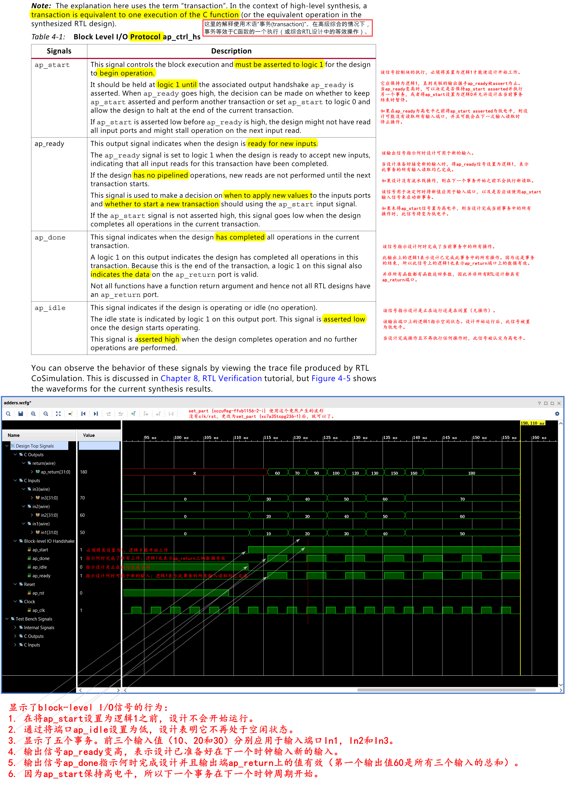

- 综合报告


### Step 3: Modify the Block-Level I/O protocol

由于**块级I/O协议与该函数相关联**，因此必须通过选择顶级函数来指定它们。

对于块级I/O协议，return参数用于指定块级接口。即使函数在源代码中没有返回参数，也是如此。

- Code

```c++
#include "adders.h"

int adders(int in1, int in2, int in3) {
#pragma HLS INTERFACE ap_ctrl_none port=return
// Prevent IO protocols on all input ports
#pragma HLS INTERFACE ap_none port=in3
#pragma HLS INTERFACE ap_none port=in2
#pragma HLS INTERFACE ap_none port=in1
	int sum;
	sum = in1 + in2 + in3;
	return sum;
}
```
- RTL CoSimulation

> ERROR: [COSIM 212-345] Cosim only supports the following **'ap_ctrl_none'** designs: (1) combinational designs; (2) pipelined 
design with task inteveral of 1; (3) designs with array streaming or hls_stream or AXI4 stream ports. 

- 综合报告

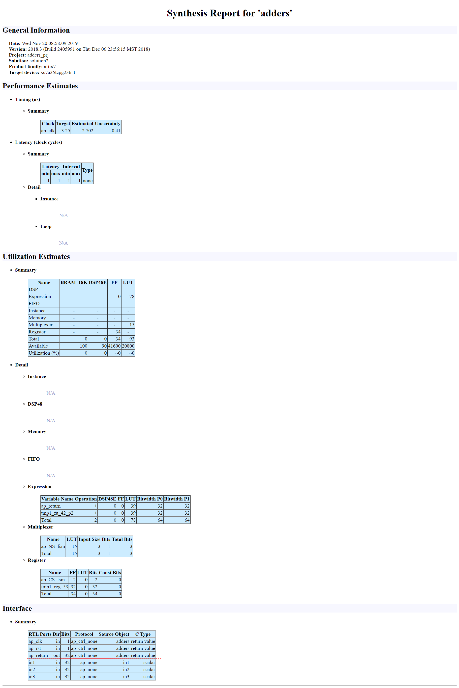

## Lab 2: Port I/O Protocols

本练习说明了如何指定**Port I/O协议**。

### Step 1: Create and Open the Project

```tcl
D:\workspace\study\FPGA\HLS\Xilinx\UG871\ug871-design-files\Interface_Synthesis\lab2>vivado_hls -f run_hls.tcl

****** Vivado(TM) HLS - High-Level Synthesis from C, C++ and SystemC v2018.3 (64-bit)
  **** SW Build 2405991 on Thu Dec  6 23:38:27 MST 2018
  **** IP Build 2404404 on Fri Dec  7 01:43:56 MST 2018
    ** Copyright 1986-2018 Xilinx, Inc. All Rights Reserved.

source C:/Xilinx/Vivado/2018.3/scripts/vivado_hls/hls.tcl -notrace
INFO: [HLS 200-10] Running 'C:/Xilinx/Vivado/2018.3/bin/unwrapped/win64.o/vivado_hls.exe'
INFO: [HLS 200-10] For user 'skd22' on host 'desktop-cl29dn1' (Windows NT_amd64 version 6.2) on Wed Nov 20 09:06:30 +0800 2019
INFO: [HLS 200-10] In directory 'D:/workspace/study/FPGA/HLS/Xilinx/UG871/ug871-design-files/Interface_Synthesis/lab2'
INFO: [HLS 200-10] Creating and opening project 'D:/workspace/study/FPGA/HLS/Xilinx/UG871/ug871-design-files/Interface_Synthesis/lab2/adders_io_prj'.
INFO: [HLS 200-10] Adding design file 'adders_io.c' to the project
INFO: [HLS 200-10] Adding test bench file 'adders_io_test.c' to the project
INFO: [HLS 200-10] Creating and opening solution 'D:/workspace/study/FPGA/HLS/Xilinx/UG871/ug871-design-files/Interface_Synthesis/lab2/adders_io_prj/solution1'.
INFO: [HLS 200-10] Cleaning up the solution database.
INFO: [HLS 200-10] Setting target device to 'xc7a35tcpg236-1'
INFO: [SYN 201-201] Setting up clock 'default' with a period of 2ns.
INFO: [SIM 211-2] *************** CSIM start ***************
INFO: [SIM 211-4] CSIM will launch GCC as the compiler.
   Compiling(apcc) ../../../../adders_io_test.c in debug mode
INFO: [HLS 200-10] Running 'C:/Xilinx/Vivado/2018.3/bin/unwrapped/win64.o/apcc.exe'
INFO: [HLS 200-10] For user 'skd22' on host 'desktop-cl29dn1' (Windows NT_amd64 version 6.2) on Wed Nov 20 09:06:34 +0800 2019
INFO: [HLS 200-10] In directory 'D:/workspace/study/FPGA/HLS/Xilinx/UG871/ug871-design-files/Interface_Synthesis/lab2/adders_io_prj/solution1/csim/build'
INFO: [APCC 202-3] Tmp directory is apcc_db
INFO: [APCC 202-1] APCC is done.
   Compiling(apcc) ../../../../adders_io.c in debug mode
INFO: [HLS 200-10] Running 'C:/Xilinx/Vivado/2018.3/bin/unwrapped/win64.o/apcc.exe'
INFO: [HLS 200-10] For user 'skd22' on host 'desktop-cl29dn1' (Windows NT_amd64 version 6.2) on Wed Nov 20 09:06:39 +0800 2019
INFO: [HLS 200-10] In directory 'D:/workspace/study/FPGA/HLS/Xilinx/UG871/ug871-design-files/Interface_Synthesis/lab2/adders_io_prj/solution1/csim/build'
INFO: [APCC 202-3] Tmp directory is apcc_db
INFO: [APCC 202-1] APCC is done.
   Generating csim.exe
  10+20+30=60
  20+30+40=90
  30+40+50=120
  40+50+60=150
  50+60+70=180
----------Pass!------------
INFO: [SIM 211-1] CSim done with 0 errors.
INFO: [SIM 211-3] *************** CSIM finish ***************
INFO: [Common 17-206] Exiting vivado_hls at Wed Nov 20 09:06:43 2019...
D:\workspace\study\FPGA\HLS\Xilinx\UG871\ug871-design-files\Interface_Synthesis\lab2>vivado_hls -p adders_io_prj

****** Vivado(TM) HLS - High-Level Synthesis from C, C++ and SystemC v2018.3 (64-bit)
  **** SW Build 2405991 on Thu Dec  6 23:38:27 MST 2018
  **** IP Build 2404404 on Fri Dec  7 01:43:56 MST 2018
    ** Copyright 1986-2018 Xilinx, Inc. All Rights Reserved.

source C:/Xilinx/Vivado/2018.3/scripts/vivado_hls/hls.tcl -notrace
INFO: [HLS 200-10] Running 'C:/Xilinx/Vivado/2018.3/bin/unwrapped/win64.o/vivado_hls.exe'
INFO: [HLS 200-10] For user 'skd22' on host 'desktop-cl29dn1' (Windows NT_amd64 version 6.2) on Wed Nov 20 09:07:02 +0800 2019
INFO: [HLS 200-10] In directory 'D:/workspace/study/FPGA/HLS/Xilinx/UG871/ug871-design-files/Interface_Synthesis/lab2'
INFO: [HLS 200-10] Bringing up Vivado HLS GUI ...
```

- Origin Code

  ```c++
  #include "adders_io.h"

  void adders_io(int in1, int in2, int *in_out1) {
    *in_out1 = in1 + in2 + *in_out1;
  }
  ```

  - 这次，代码没有函数返回值，而是通过指针参数*in_out1传递函数的输出。这也提供了探索双向（输入和输出）端口的接口选项的机会。
  - 可以通过接口综合添加到C**函数参数的I/O协议的类型取决于参数类型**。
  - 在此示例中，**指针参数**既是函数的输入，也是输出。在RTL设计中，此**参数实现为单独的输入和输出端口**。

  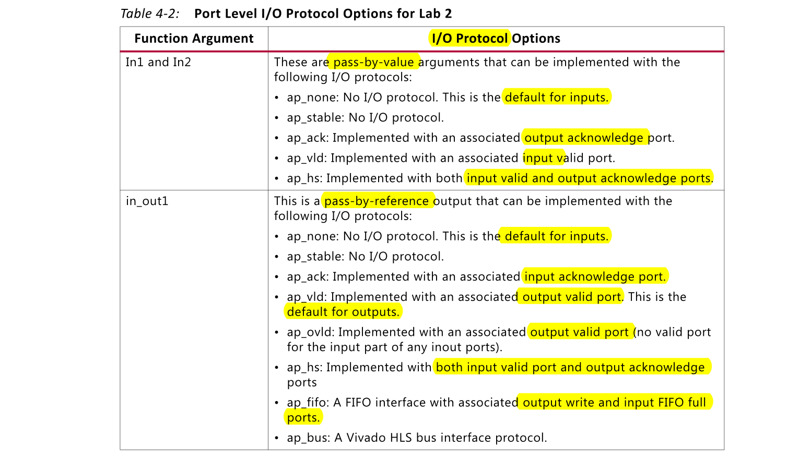

### Step 2: Specify the I/O Protocol for Ports

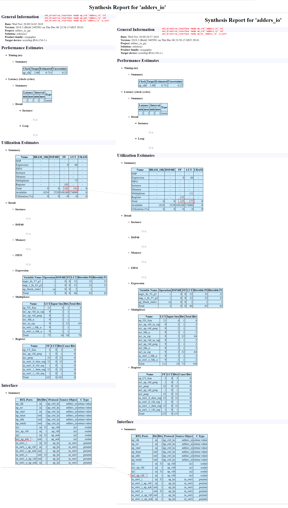

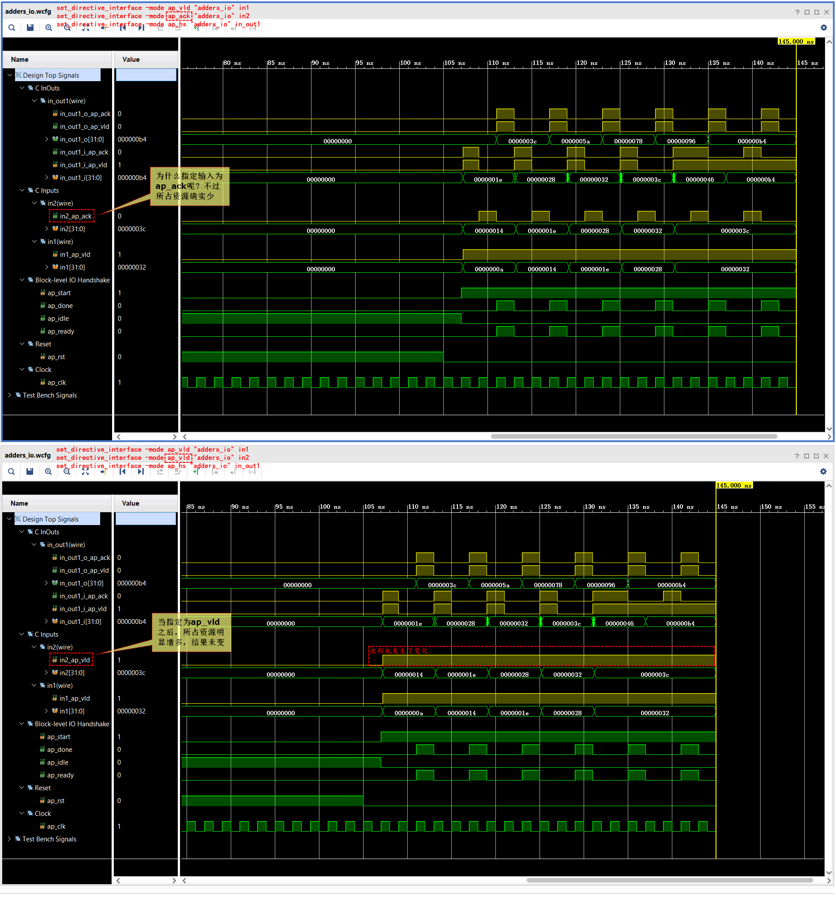

## Lab 3: Implementing Arrays as RTL Interfaces

本练习说明如何将顶层函数接口上的**数组参数**实现为多种不同类型的RTL端口。

### Step 1: Create and Open the Project

```tcl
D:\workspace\study\FPGA\HLS\Xilinx\UG871\ug871-design-files\Interface_Synthesis\lab3>vivado_hls -f run_hls.tcl

****** Vivado(TM) HLS - High-Level Synthesis from C, C++ and SystemC v2018.3 (64-bit)
  **** SW Build 2405991 on Thu Dec  6 23:38:27 MST 2018
  **** IP Build 2404404 on Fri Dec  7 01:43:56 MST 2018
    ** Copyright 1986-2018 Xilinx, Inc. All Rights Reserved.

source C:/Xilinx/Vivado/2018.3/scripts/vivado_hls/hls.tcl -notrace
INFO: [HLS 200-10] Running 'C:/Xilinx/Vivado/2018.3/bin/unwrapped/win64.o/vivado_hls.exe'
INFO: [HLS 200-10] For user 'skd22' on host 'desktop-cl29dn1' (Windows NT_amd64 version 6.2) on Wed Nov 20 09:50:56 +0800 2019
INFO: [HLS 200-10] In directory 'D:/workspace/study/FPGA/HLS/Xilinx/UG871/ug871-design-files/Interface_Synthesis/lab3'
INFO: [HLS 200-10] Creating and opening project 'D:/workspace/study/FPGA/HLS/Xilinx/UG871/ug871-design-files/Interface_Synthesis/lab3/array_io_prj'.
INFO: [HLS 200-10] Adding design file 'array_io.c' to the project
INFO: [HLS 200-10] Adding test bench file 'array_io_test.c' to the project
INFO: [HLS 200-10] Adding test bench file 'result.golden.dat' to the project
INFO: [HLS 200-10] Creating and opening solution 'D:/workspace/study/FPGA/HLS/Xilinx/UG871/ug871-design-files/Interface_Synthesis/lab3/array_io_prj/solution1'.
INFO: [HLS 200-10] Cleaning up the solution database.
INFO: [HLS 200-10] Setting target device to 'xczu9eg-ffvb1156-2-i'
INFO: [SYN 201-201] Setting up clock 'default' with a period of 4ns.
INFO: [SIM 211-2] *************** CSIM start ***************
INFO: [SIM 211-4] CSIM will launch GCC as the compiler.
   Compiling(apcc) ../../../../array_io_test.c in debug mode
INFO: [HLS 200-10] Running 'C:/Xilinx/Vivado/2018.3/bin/unwrapped/win64.o/apcc.exe'
INFO: [HLS 200-10] For user 'skd22' on host 'desktop-cl29dn1' (Windows NT_amd64 version 6.2) on Wed Nov 20 09:51:00 +0800 2019
INFO: [HLS 200-10] In directory 'D:/workspace/study/FPGA/HLS/Xilinx/UG871/ug871-design-files/Interface_Synthesis/lab3/array_io_prj/solution1/csim/build'
INFO: [APCC 202-3] Tmp directory is apcc_db
INFO: [APCC 202-1] APCC is done.
   Compiling(apcc) ../../../../array_io.c in debug mode
INFO: [HLS 200-10] Running 'C:/Xilinx/Vivado/2018.3/bin/unwrapped/win64.o/apcc.exe'
INFO: [HLS 200-10] For user 'skd22' on host 'desktop-cl29dn1' (Windows NT_amd64 version 6.2) on Wed Nov 20 09:51:05 +0800 2019
INFO: [HLS 200-10] In directory 'D:/workspace/study/FPGA/HLS/Xilinx/UG871/ug871-design-files/Interface_Synthesis/lab3/array_io_prj/solution1/csim/build'
INFO: [APCC 202-3] Tmp directory is apcc_db
INFO: [APCC 202-1] APCC is done.
   Generating csim.exe
Test passed !
INFO: [SIM 211-1] CSim done with 0 errors.
INFO: [SIM 211-3] *************** CSIM finish ***************
INFO: [Common 17-206] Exiting vivado_hls at Wed Nov 20 09:51:09 2019...
D:\workspace\study\FPGA\HLS\Xilinx\UG871\ug871-design-files\Interface_Synthesis\lab3>vivado_hls -p array_io_prj

****** Vivado(TM) HLS - High-Level Synthesis from C, C++ and SystemC v2018.3 (64-bit)
  **** SW Build 2405991 on Thu Dec  6 23:38:27 MST 2018
  **** IP Build 2404404 on Fri Dec  7 01:43:56 MST 2018
    ** Copyright 1986-2018 Xilinx, Inc. All Rights Reserved.

source C:/Xilinx/Vivado/2018.3/scripts/vivado_hls/hls.tcl -notrace
INFO: [HLS 200-10] Running 'C:/Xilinx/Vivado/2018.3/bin/unwrapped/win64.o/vivado_hls.exe'
INFO: [HLS 200-10] For user 'skd22' on host 'desktop-cl29dn1' (Windows NT_amd64 version 6.2) on Wed Nov 20 09:51:19 +0800 2019
INFO: [HLS 200-10] In directory 'D:/workspace/study/FPGA/HLS/Xilinx/UG871/ug871-design-files/Interface_Synthesis/lab3'
INFO: [HLS 200-10] Bringing up Vivado HLS GUI ...
```

- array_io.h

  ```c++
  #ifndef ARRAY_IO_H_
  #define ARRAY_IO_H_
  
  #include <stdio.h>

  typedef short din_t;
  typedef short dout_t;
  typedef int dacc_t;

  #define CHANNELS 8
  #define SAMPLES  4
  #define N CHANNELS * SAMPLES

  void array_io (dout_t d_o[N], din_t d_i[N]);

  #endif
  ```

- array_io.c
  
  ```c++
  #include "array_io.h"

  // The data comes in organized in a single array.
  // - The first sample for the first channel (CHAN)
  // - Then the first sample for the 2nd channel etc.
  // The channels are accumulated independently
  // E.g. For 8 channels:
  // Array Order :  0  1  2  3  4  5  6  7  8     9     10    etc. 16       etc...
  // Sample Order:  A0 B0 C0 D0 E0 F0 G0 H0 A1    B1    C2    etc. A2       etc...
  // Output Order:  A0 B0 C0 D0 E0 F0 G0 H0 A0+A1 B0+B1 C0+C2 etc. A0+A1+A2 etc...

  void array_io (dout_t d_o[N], din_t d_i[N]) {
    int i, rem;
    
    // Store accumulated data
    static dacc_t acc[CHANNELS];
    dacc_t temp;

    // Accumulate each channel
    For_Loop: for (i=0;i<N;i++) {
      rem=i%CHANNELS;
      temp = acc[rem] + d_i[i];
      acc[rem] = temp;
      d_o[i] = acc[rem];
    }
  }
  ```
### Step 2: Synthesize Array Function Arguments to RAM Ports

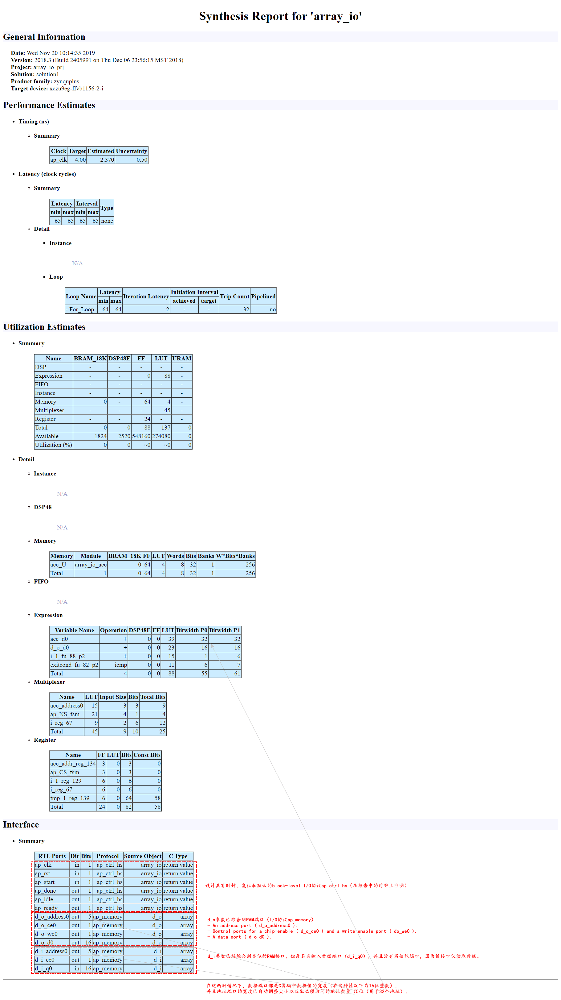


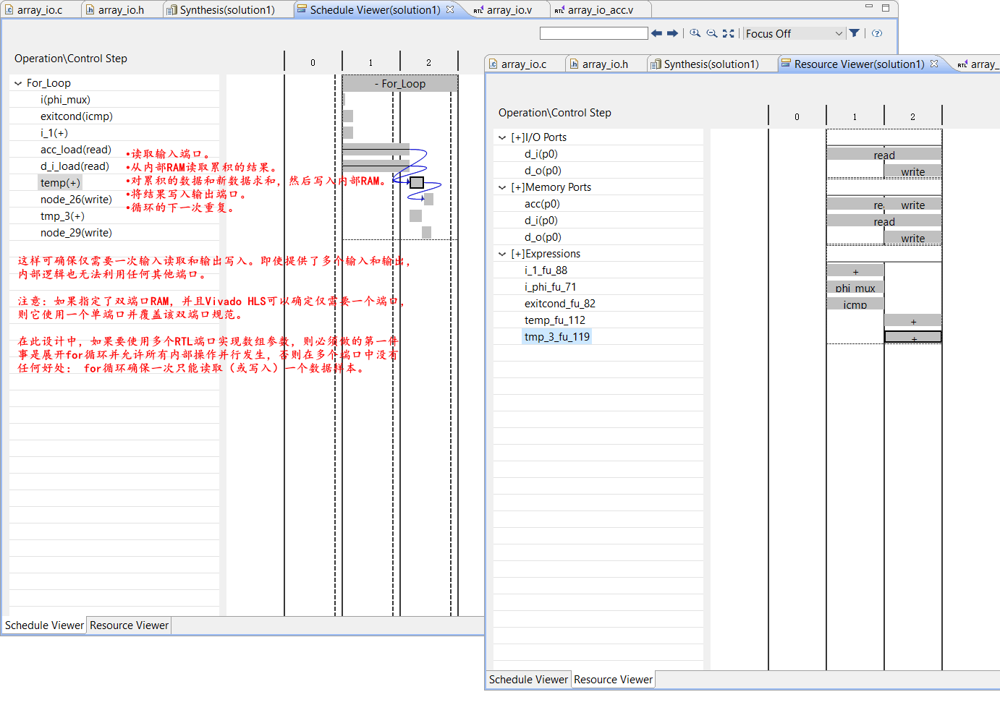

### Step 3: Using Dual-Port RAM and FIFO Interfaces

高级综合允许您将RAM接口指定为单端口或双端口。**如果没有选择，Vivado HLS会自动分析设计并选择端口数量以最大化数据速率**。

默认情况下，将**数组参数综合到RAM端口**。您可以使用许多其他选项控制如何实现这些端口。实验3的其余步骤演示了这些选项：
- 使用单端口或双端口RAM接口。
- 使用FIFO接口。
- 划分为离散端口。


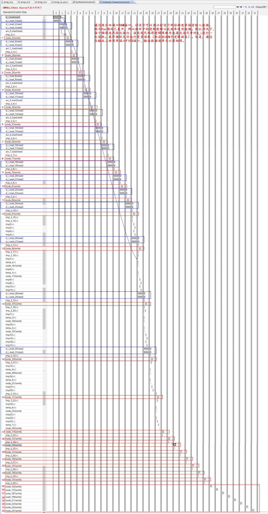


### Step 4: Partitioned RAM and FIFO Array interfaces


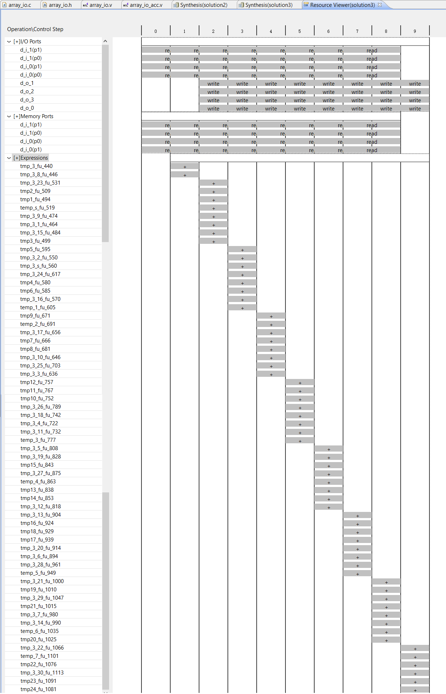


如果将输入端口d_i划分为四个，则每个端口仅需要一个单端口RAM接口。由于输出端口一次只能输出四个值，因此一次读取八个输入不会有任何好处。

### Step 5: Fully Partitioned Array Interfaces


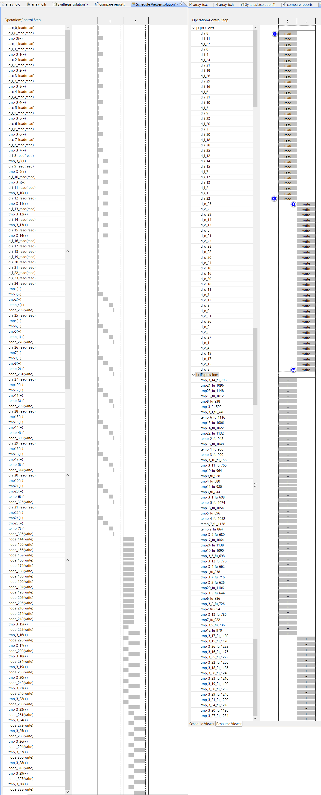

### 综合对比


## Lab 4: Implementing AXI4 Interfaces

本练习说明了**如何为I/O端口指定AXI4总线接口**。除了添加AXI4接口之外，本练习还展示了如何通过同时使用接口和逻辑指令来创建最佳设计。

### Step 1: Create and Open the Project
- axi_interfaces.h
  
  ```c++
  #ifndef AXI_INTERFACES_H_
  #define AXI_INTERFACES_H_
  
  #include <stdio.h>

  typedef short din_t;
  typedef short dout_t;
  typedef int dacc_t;

  #define CHANNELS 8
  #define SAMPLES  4
  #define N CHANNELS * SAMPLES

  void axi_interfaces (dout_t d_o[N], din_t d_i[N]);

  #endif
  ```
- axi_interfaces.c
  
  ```c++
  #include "axi_interfaces.h"

  // The data comes in organized in a single array.
  // - The first sample for the first channel (CHAN)
  // - Then the first sample for the 2nd channel etc.
  // The channels are accumulated independently
  // E.g. For 8 channels:
  // Array Order :  0  1  2  3  4  5  6  7  8     9     10    etc. 16       etc...
  // Sample Order:  A0 B0 C0 D0 E0 F0 G0 H0 A1    B1    C2    etc. A2       etc...
  // Output Order:  A0 B0 C0 D0 E0 F0 G0 H0 A0+A1 B0+B1 C0+C2 etc. A0+A1+A2 etc...

  void axi_interfaces (dout_t d_o[N], din_t d_i[N]) {
    int i, rem;
    
    // Store accumulated data
    static dacc_t acc[CHANNELS];

    // Accumulate each channel
    For_Loop: for (i=0;i<N;i++) {
      rem=i%CHANNELS;
      acc[rem] = acc[rem] + d_i[i];
      d_o[i] = acc[rem];
    }
  }
  ```

### Step 2: Create an Optimal Design with AXI4-Stream Interfaces

为了实现此设计的最佳性能，**每个通道的数据都使用专用硬件并行处理**。

在本练习中，您将指定要作为AXI4-Stream接口实现的数组参数。如果**将数组划分为多个通道**，则可以**并行地**通过设计**将每个通道的样本流式传输**。

最后，如果**将I/O端口配置为提供和使用通道数据的独立流**，则**for-loop的部分展开**可以确保每个通道都有专用的硬件处理。

流水线化的for循环允许每个通道中的逻辑**每个时钟处理1个样本**。通过**改变分区和循环展开**，可以创建一种设计，该设计是面积和性能的最佳平衡，以满足您的特定要求。


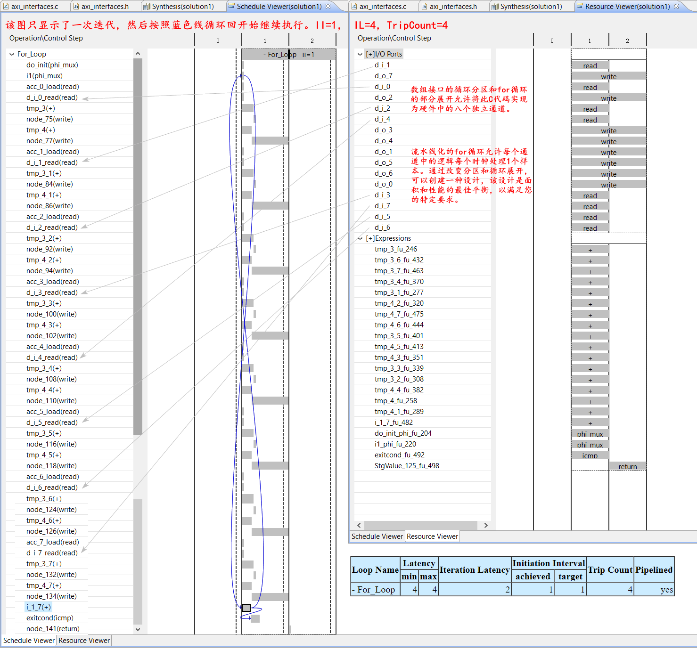

### Step 3: Implementing an AXI4-Lite Interfaces

在本练习中，您**将块级I/O协议端口组合到单个AXI4-Lite接口**中，该接口**允许从CPU控制和访问这些块级控制信号**。

选择模式下拉菜单，然后选择s_axilite。这指定与函数返回关联的端口（块级I/O端口）被实现为AXI4-Lite接口。**由于函数返回的默认模式是ap_ctrl_hs，因此无需指定此I/O协议**。


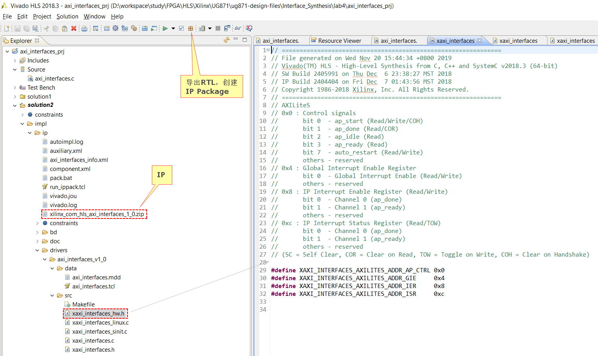

