# Ch6 Design Analysis

从C，C++或SystemC创建RTL实现的通用设计方法包括以下任务：
- 综合设计。
- 审查初始实施的结果。
- 应用优化指令以提高性能。

您可以重复上述步骤，直到达到所需的性能。随后，您可以重新访问设计以改进面积。

此过程的关键部分是结果分析。本教程说明了如何使用报告和GUI Analysis透视图来分析设计并确定要应用的优化。
本教程包含一个实验练习：
- 演示HLS交互式分析功能。
- 从最初的实施到六个步骤以及多次优化引导您完成一个设计，以产生最终的优化设计。

正如整个教程中所演示的，在单个项目中执行这些步骤使您能够比较不同的解决方案。

## Lab 1: Design Optimization

本练习说明了GUI Analysis透视图的基本操作以及如何使用它来推动设计优化。

### Step 1: Create and Open the Project

```tcl
D:\workspace\study\FPGA\HLS\Xilinx\UG871\ug871-design-files\Design_Analysis\lab1>vivado_hls -f run_hls.tcl

****** Vivado(TM) HLS - High-Level Synthesis from C, C++ and SystemC v2018.3 (64-bit)
  **** SW Build 2405991 on Thu Dec  6 23:38:27 MST 2018
  **** IP Build 2404404 on Fri Dec  7 01:43:56 MST 2018
    ** Copyright 1986-2018 Xilinx, Inc. All Rights Reserved.

source C:/Xilinx/Vivado/2018.3/scripts/vivado_hls/hls.tcl -notrace
INFO: [HLS 200-10] Running 'C:/Xilinx/Vivado/2018.3/bin/unwrapped/win64.o/vivado_hls.exe'
INFO: [HLS 200-10] For user 'skd22' on host 'desktop-cl29dn1' (Windows NT_amd64 version 6.2) on Thu Nov 21 11:08:26 +0800 2019
INFO: [HLS 200-10] In directory 'D:/workspace/study/FPGA/HLS/Xilinx/UG871/ug871-design-files/Design_Analysis/lab1'
INFO: [HLS 200-10] Creating and opening project 'D:/workspace/study/FPGA/HLS/Xilinx/UG871/ug871-design-files/Design_Analysis/lab1/dct_prj'.
INFO: [HLS 200-10] Adding design file 'dct.cpp' to the project
INFO: [HLS 200-10] Adding test bench file 'dct_test.cpp' to the project
INFO: [HLS 200-10] Adding test bench file 'in.dat' to the project
INFO: [HLS 200-10] Adding test bench file 'out.golden.dat' to the project
INFO: [HLS 200-10] Creating and opening solution 'D:/workspace/study/FPGA/HLS/Xilinx/UG871/ug871-design-files/Design_Analysis/lab1/dct_prj/solution1'.
INFO: [HLS 200-10] Cleaning up the solution database.
INFO: [HLS 200-10] Setting target device to 'xczu9eg-ffvb1156-2-i'
INFO: [SYN 201-201] Setting up clock 'default' with a period of 8ns.
INFO: [SIM 211-2] *************** CSIM start ***************
INFO: [SIM 211-4] CSIM will launch GCC as the compiler.
   Compiling ../../../../dct_test.cpp in debug mode
   Compiling ../../../../dct.cpp in debug mode
   Generating csim.exe
Test passed !
INFO: [SIM 211-1] CSim done with 0 errors.
INFO: [SIM 211-3] *************** CSIM finish ***************
INFO: [Common 17-206] Exiting vivado_hls at Thu Nov 21 11:08:32 2019...
D:\workspace\study\FPGA\HLS\Xilinx\UG871\ug871-design-files\Design_Analysis\lab1>run_hls.tcl -p dct_prj

D:\workspace\study\FPGA\HLS\Xilinx\UG871\ug871-design-files\Design_Analysis\lab1>vivado_hls -p dct_prj

****** Vivado(TM) HLS - High-Level Synthesis from C, C++ and SystemC v2018.3 (64-bit)
  **** SW Build 2405991 on Thu Dec  6 23:38:27 MST 2018
  **** IP Build 2404404 on Fri Dec  7 01:43:56 MST 2018
    ** Copyright 1986-2018 Xilinx, Inc. All Rights Reserved.

source C:/Xilinx/Vivado/2018.3/scripts/vivado_hls/hls.tcl -notrace
INFO: [HLS 200-10] Running 'C:/Xilinx/Vivado/2018.3/bin/unwrapped/win64.o/vivado_hls.exe'
INFO: [HLS 200-10] For user 'skd22' on host 'desktop-cl29dn1' (Windows NT_amd64 version 6.2) on Thu Nov 21 11:09:10 +0800 2019
INFO: [HLS 200-10] In directory 'D:/workspace/study/FPGA/HLS/Xilinx/UG871/ug871-design-files/Design_Analysis/lab1'
INFO: [HLS 200-10] Bringing up Vivado HLS GUI ...
```

- dct.h
  
  ```c++
  #ifndef __DCT_H__
  #define __DCT_H__

  #include <fstream>
  #include <iostream>
  #include <iomanip>
  #include <cstdlib>

  #define DW 16
  #define N 1024/DW
  #define NUM_TRANS 16

  typedef short dct_data_t;

  #define DCT_SIZE 8    /* defines the input matrix as 8x8 */
  #define CONST_BITS  13
  #define DESCALE(x,n)  (((x) + (1 << ((n)-1))) >> n)

  void dct(short input[N], short output[N]);

  #endif // __DCT_H__ not defined
  ```

- dct.cpp
  
  ```c++
  #include "dct.h"

  void dct_1d(dct_data_t src[DCT_SIZE], dct_data_t dst[DCT_SIZE])
  {
    unsigned int k, n;
    int tmp;
    const dct_data_t dct_coeff_table[DCT_SIZE][DCT_SIZE] = {
  #include "dct_coeff_table.txt"
    };

  DCT_Outer_Loop:
    for (k = 0; k < DCT_SIZE; k++) {
  DCT_Inner_Loop:
        for(n = 0, tmp = 0; n < DCT_SIZE; n++) {
          int coeff = (int)dct_coeff_table[k][n];
          tmp += src[n] * coeff;
        }
        dst[k] = DESCALE(tmp, CONST_BITS);
    }
  }

  void dct_2d(dct_data_t in_block[DCT_SIZE][DCT_SIZE],
        dct_data_t out_block[DCT_SIZE][DCT_SIZE])
  {
    dct_data_t row_outbuf[DCT_SIZE][DCT_SIZE];
    dct_data_t col_outbuf[DCT_SIZE][DCT_SIZE], col_inbuf[DCT_SIZE][DCT_SIZE];
    unsigned i, j;

    // DCT rows
  Row_DCT_Loop:
    for(i = 0; i < DCT_SIZE; i++) {
        dct_1d(in_block[i], row_outbuf[i]);
    }
    // Transpose data in order to re-use 1D DCT code
  Xpose_Row_Outer_Loop:
    for (j = 0; j < DCT_SIZE; j++)
  Xpose_Row_Inner_Loop:
        for(i = 0; i < DCT_SIZE; i++)
          col_inbuf[j][i] = row_outbuf[i][j];
    // DCT columns
  Col_DCT_Loop:
    for (i = 0; i < DCT_SIZE; i++) {
        dct_1d(col_inbuf[i], col_outbuf[i]);
    }
    // Transpose data back into natural order
  Xpose_Col_Outer_Loop:
    for (j = 0; j < DCT_SIZE; j++)
  Xpose_Col_Inner_Loop:
        for(i = 0; i < DCT_SIZE; i++)
          out_block[j][i] = col_outbuf[i][j];
  }

  void read_data(short input[N], short buf[DCT_SIZE][DCT_SIZE])
  {
    int r, c;

  RD_Loop_Row:
    for (r = 0; r < DCT_SIZE; r++) {
  RD_Loop_Col:
        for (c = 0; c < DCT_SIZE; c++)
          buf[r][c] = input[r * DCT_SIZE + c];
    }
  }

  void write_data(short buf[DCT_SIZE][DCT_SIZE], short output[N])
  {
    int r, c;

  WR_Loop_Row:
    for (r = 0; r < DCT_SIZE; r++) {
  WR_Loop_Col:
        for (c = 0; c < DCT_SIZE; c++)
          output[r * DCT_SIZE + c] = buf[r][c];
    }
  }

  void dct(short input[N], short output[N])
  {
    short buf_2d_in[DCT_SIZE][DCT_SIZE];
    short buf_2d_out[DCT_SIZE][DCT_SIZE];

    // Read input data. Fill the internal buffer.
    read_data(input, buf_2d_in);

    dct_2d(buf_2d_in, buf_2d_out);

    // Write out the results.
    write_data(buf_2d_out, output);
  }
  ```

- dct_coeff_table.txt

  ```txt
    8192,  8192,  8192,  8192,  8192,  8192,  8192,  8192,
    11363,  9633,  6436,  2260, -2260, -6436, -9632,-11362,
    10703,  4433, -4433,-10703,-10703, -4433,  4433, 10703,
    9633, -2260,-11362, -6436,  6436, 11363,  2260, -9632,
    8192, -8192, -8192,  8192,  8192, -8191, -8191,  8192,
    6436,-11362,  2260,  9633, -9632, -2260, 11363, -6436,
    4433,-10703, 10703, -4433, -4433, 10703,-10703,  4433,
    2260, -6436,  9633,-11362, 11363, -9632,  6436, -2260
  ```

### Step 2: Review the Source Code and Create the Initial Design

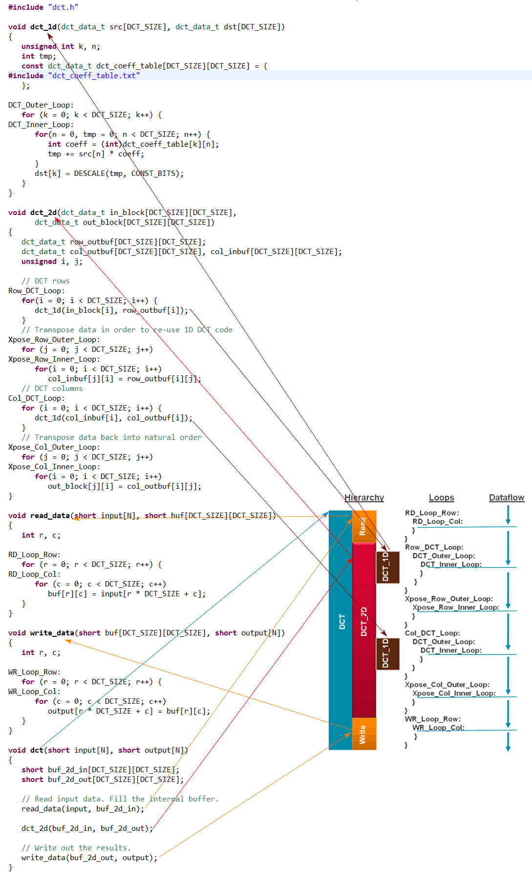

### Step 3: Review the Performance Using the Synthesis Report

**分析报告如下内容重点注意**：
  - 已满足8ns的时钟频率
  - 顶层设计需要2935个时钟周期来写入所有输出。
  - 您可以在2935个时钟周期后应用新的输入。这立即表明该设计未进行流水线化，但是在报告中也注意到了这一事实：类型设置为无且未进行流水线化。
  - 顶层具有单个实例，其延迟和启动间隔为2644。
  	- 该模块也没有流水线，占了大多数时钟周期。
  - 请注意，这里未将函数read_data和write_data标记为顶层的实例。
  	- 图6-5显示，在合成期间，这些块会自动内联（层次结构已删除）。
  	- 高级综合可能会自动内联小的函数以提高结果的质量（QoR）。您可以通过将带有-off选项的Inline指令添加到任何自动内联的函数中来防止这种情况。
  - 因此，read_data和write_data函数中的循环在顶层实现，并在顶层函数中报告为循环。
  - 每个循环的延迟为144个时钟周期。（因为没有对循环进行流水线处理，所以没有启动间隔。） 
  - 以RD_Loop_Row为例，您可以了解为什么循环延迟为144。
  	- 子循环RD_Loop_Col对于循环的每次迭代有2个周期的延迟（迭代等待时间），并且跳闸计数为8：2 x 8 = 16个时钟周期，该循环的总等待时间。
  	- 从RD_Loop_Row，进入循环RD_Loop_Col需要1个时钟，而返回RD_Loop_Row需要1个时钟周期。因此，RD_Loop_Row的迭代延迟为（1 + 16 +1）18个时钟周期。
  	- RD_Loop_Row的跳闸计数为8，因此总循环延迟为8 x 18 = 144个时钟周期。
  - 因此，dct块的2935个周期的总延迟为：
  	- RD_Loop_Row块的144个时钟。
  	- 加上dct_2d块的2644个时钟周期。
  	- 为WR_Loop_Row加144个时钟周期。
  	- 再加上每次进入这三个模块消耗的一个时钟周期。

第一行列出了设计中的控制状态。**控制状态**是高级综合用来将操作调度到时钟周期中的内部状态。在RTL有限状态机（FSM）中，控制状态与最终状态之间存在密切的关联，但是没有一对一的映射。

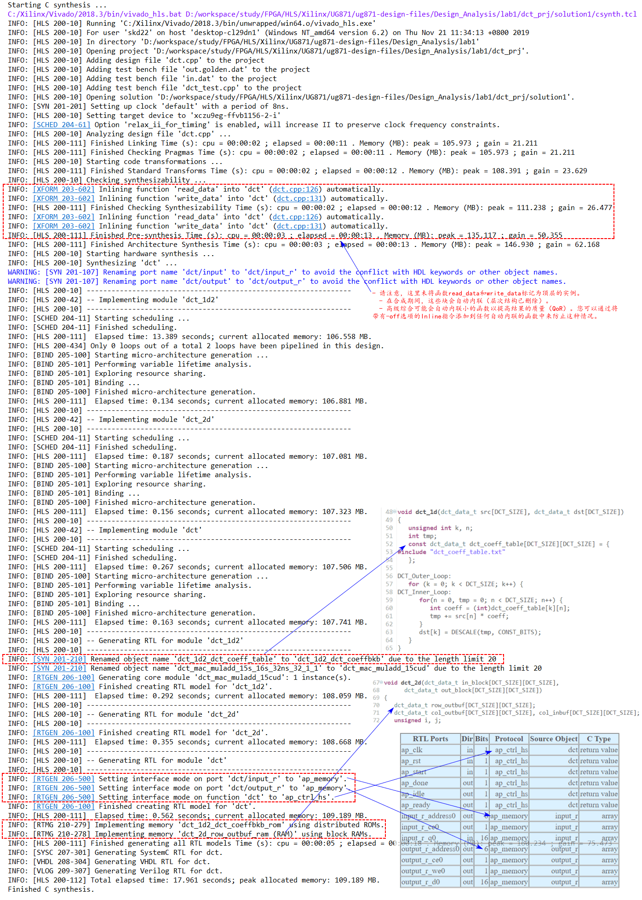


### Step 4: Review the Performance Using the Analysis Perspective

 
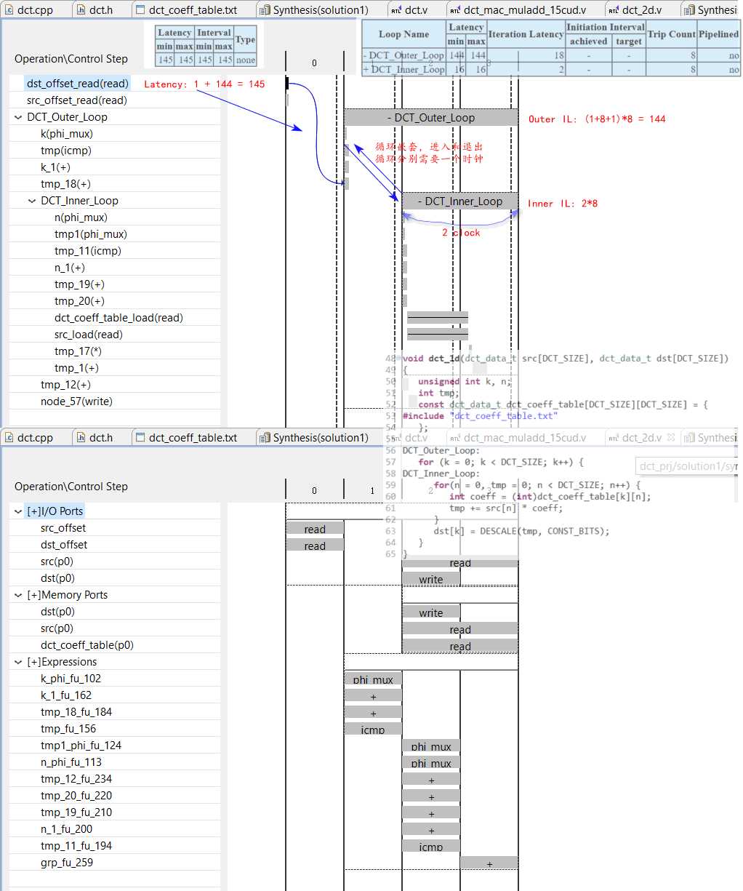

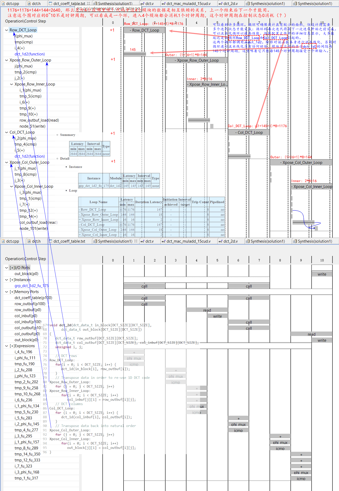

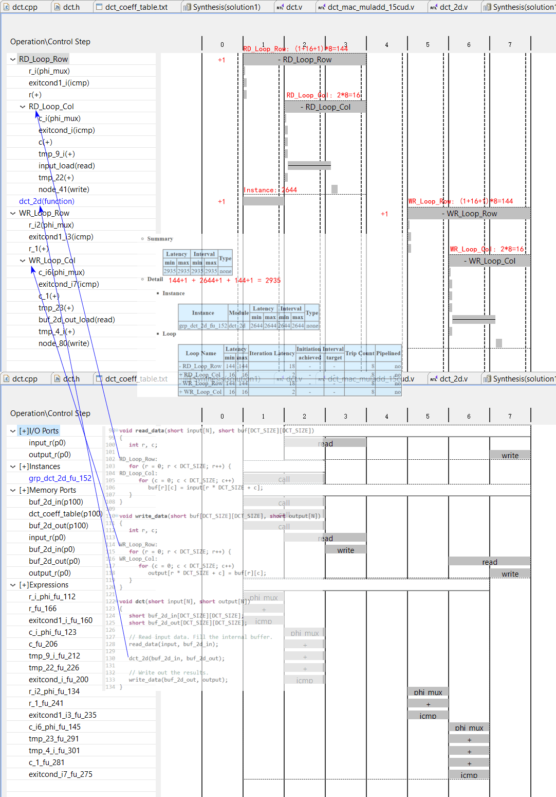

### Step 5: Apply Loop Pipelining and Review for Loop Optimization 

当对嵌套循环进行流水线处理时，**通常最好对最内层的循环进行流水线处理**。通常，“高级综合”通常可以自动平整循环嵌套（允许外循环简单地feed内循环）。有关为什么最好执行某些循环优化而不是其他优化的更多信息，请参见第7章，设计优化教程。

#### 代码配置

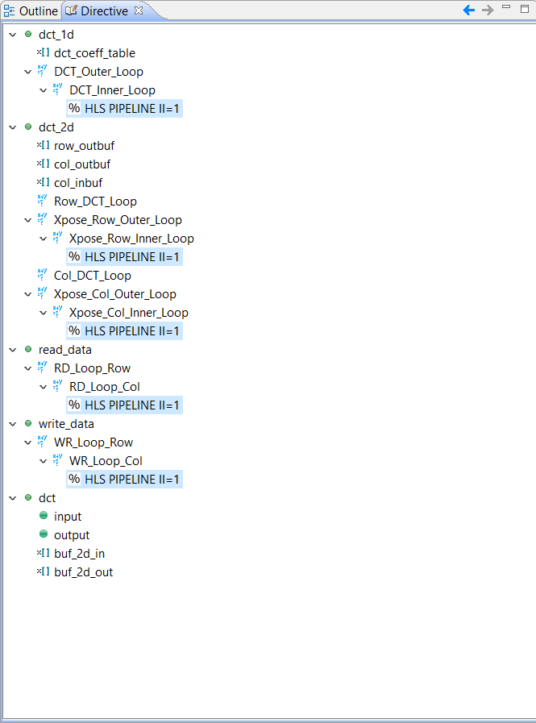

#### 时序分析


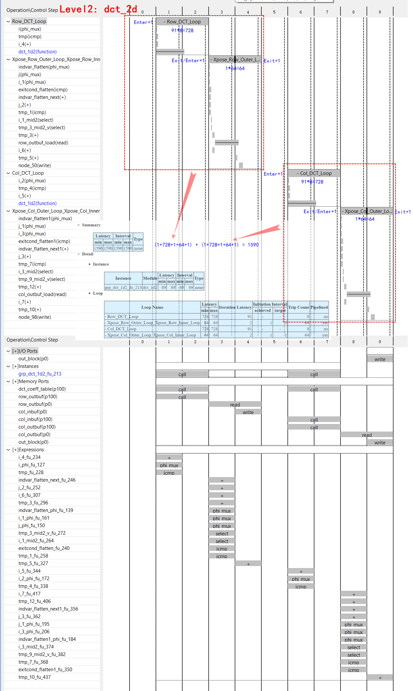

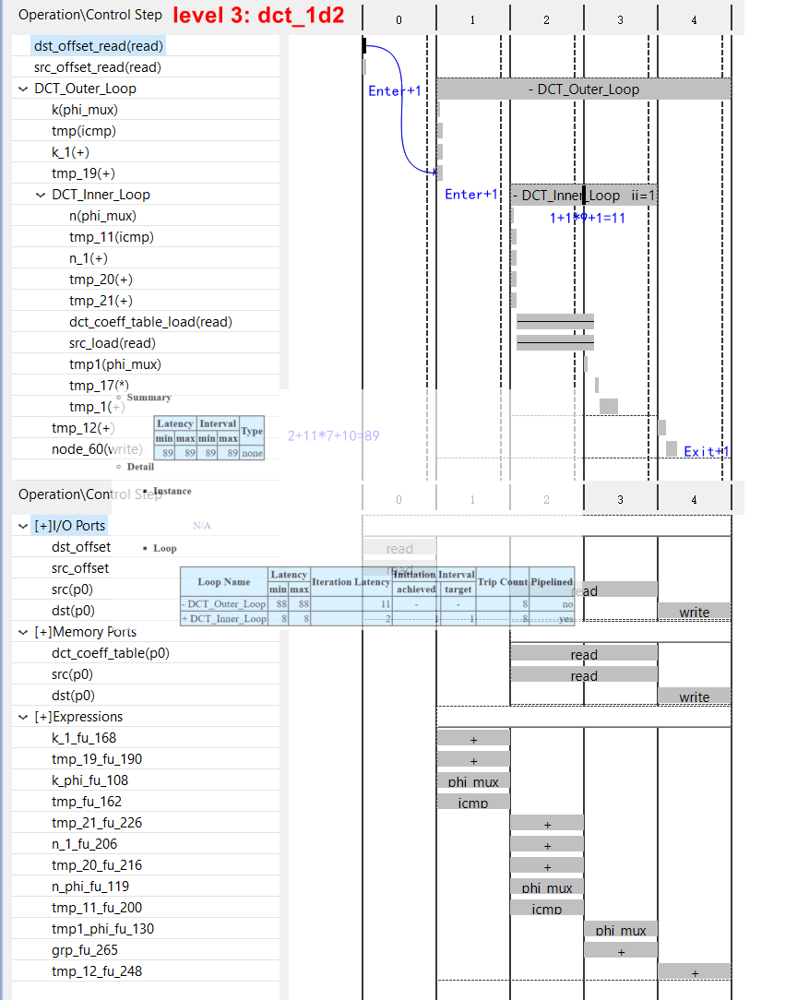

#### 如何计算clock


### Step 6: Apply Loop Optimization and Review for Bottlenecks


无法将写入数组的内容flatten到inner loop中。要在DCT outer loop上达到间隔1，您将需要对输出环路进行流水线处理-简单地对内环路本身进行流水处理没有任何好处。

您应该改为pipeline outer loop。这将导致inner loop 完全unrolled。会导致面积增加，但是您仍然离125的吞吐量目标还很远，还没有准备好流水线化整个函数（并且看到更大的面积增加，因为outer loop也已完全unrolled）。

#### 代码配置


#### 时序分析

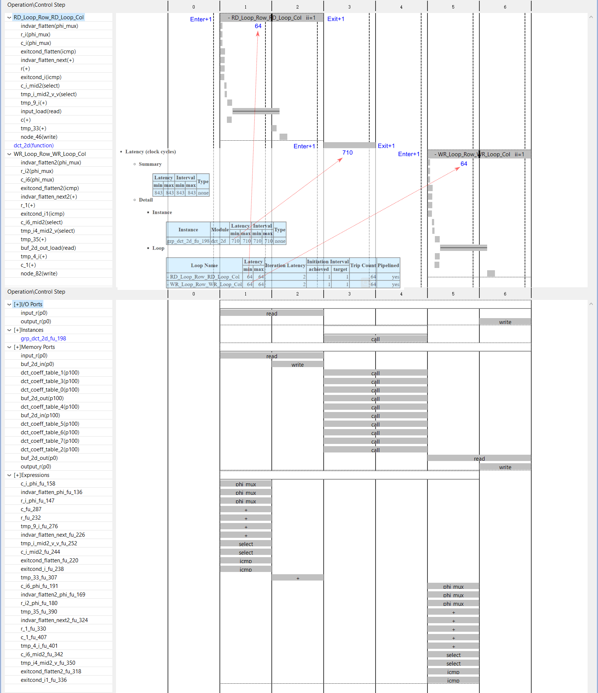

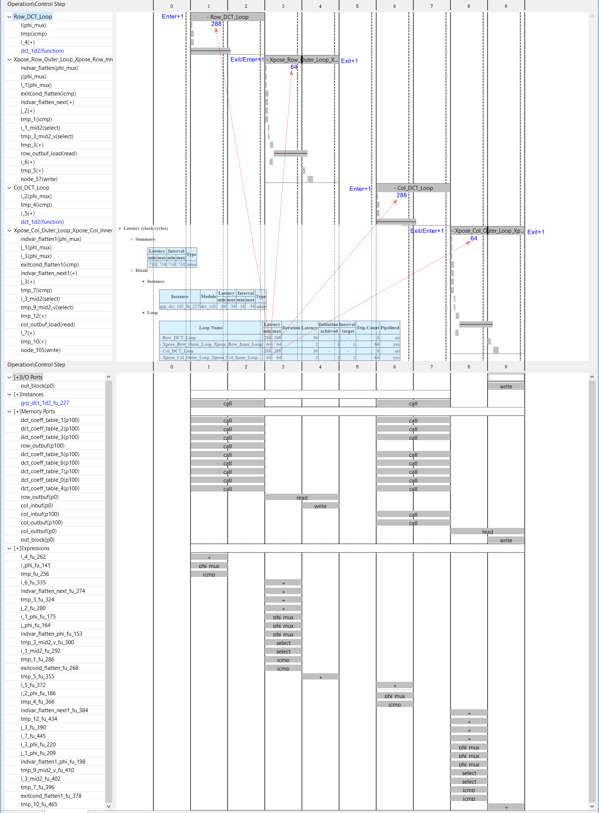

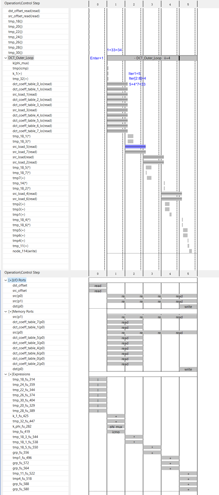

#### 如何计算clock


#### 瓶颈分析

现在，所有的循环都已经流水线化了，值得回顾一下设计以查看是否存在性能限制的“瓶颈”。瓶颈是数据流的限制，可以阻止逻辑块以其最大数据速率工作。

数据流中的此类限制可能来自多种来源，例如，**实现为Block RAM的I/O端口和数组**。在这两种情况下，有限数量的端口（在I/O或Block RAM上）都会限制数据的读写速率。

瓶颈的另一个来源是原始源代码中的**数据依赖性**。在某些情况下，这些数据依赖是算法工作方式所固有的，例如，在更早的计算完成之前无法执行计算时。但是，有时使用优化指令或对C代码进行较小的更改可以将其删除。

第一项任务是确定RTL设计中的此类问题。您可以采用**多种方法**：
- 从“模块层次结构”报告中最大的延迟或时间间隔开始，然后在层次结构中向下导航，以查找任何较大的延迟或时间间隔的来源。
- 单击`Resource Profile`文件以检查I/O和内存使用情况。
- 使用图形查看器的功能，并在“Performance”视图中查找指示数据流受限的模式。

在这个案例，您将使用最后一种方法。您可以使用Analysis透视图快速识别设计中的此类位置。

1. 单击Analysis透视图按钮开始交互式设计分析。
2. 在“模块层次结构”中，确保已选择模块dct。
3. 在Performance视图中，展开设计中的第一个循环，如图6-21所示，RD_Loop_Row_RD_Loop_Col（这些循环被展平，并且名称现在是两个循环的串联）。

此循环以两种状态实现。图6-21中的红色箭头显示了**从循环开始到循环结束的路径：该箭头几乎是垂直的**（一切都发生在两个时钟周期内），并且此循环在延迟方面得到了很好的实现。

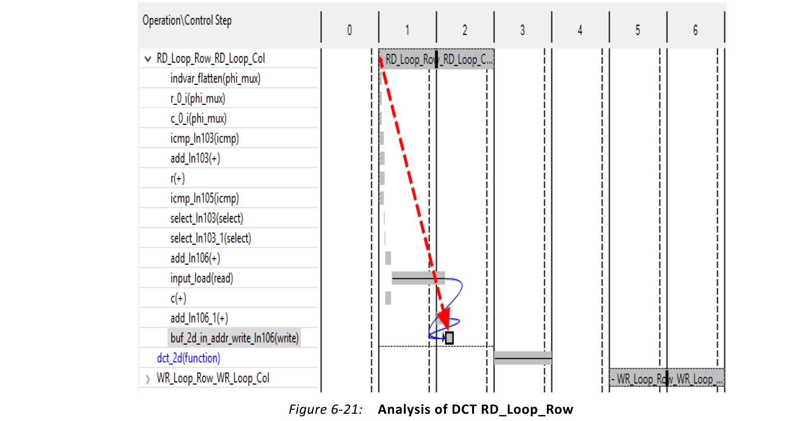

10. 在Performance视图中，展开WR_Loop_Row_WR_Loop_Col并执行类似的分析。同样，它对延迟进行了很好的优化。
11. 双击函数dct_2d并导航到dct_2d函数。
您可以在整个层次结构中使用相同的分析过程。如果执行此分析，您将发现所有功能块和循环都具有类似的最佳（很少周期）实现，直到检查了dct_1d块为止。
12. 在“性能”视图中，双击功能dct_1d2并导航到dct_1d2功能。
13. 展开DCT_Outer_Loop以查看图6-22中所示的视图。

图6-22显示了与以前的循环调度（只有几个延迟周期）截然不同的视图。调度显示从输入到输出的长时间漂移（如红色箭头所示）。

图6-22显示了dct_1d RD_Loop_Row的分析。


通常，有**两种原因**会导致这种类型的调度：**源代码中的数据依赖性以及由于I/O或Block RAM而造成的限制**。现在，您将检查此块中的资源共享。

14. 在Performance视图中，单击窗口底部的Resource Viewer选项卡。
15. 展开Memory Port，如图6-23所示。

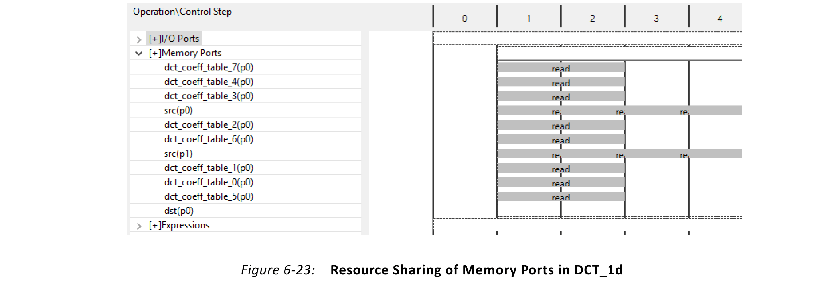

资源视图显示了如何在不同的控制状态下使用设计中的资源。

这些row列出了设计中的资源。在图6-23中，内存资源被展开了。

这些columns显示了使用资源的控制状态。**如果资源在多种状态下处于活动状态，则该资源将在不同的时钟周期内重复使用**。

图6-23显示了在每个时钟周期内最大限度地使用Block RAM `src`上的存储器访问。（一个Block RAM最多可以是双端口，并且两个端口都在使用）。这很好地表明了设计可能受到内存资源的带宽限制。要确定是否确实如此，可以进一步检查。

16. 选择src Block RAM的读取操作之一。
17. 右键单击并选择Goto Source，以查看图6-24中所示的视图。

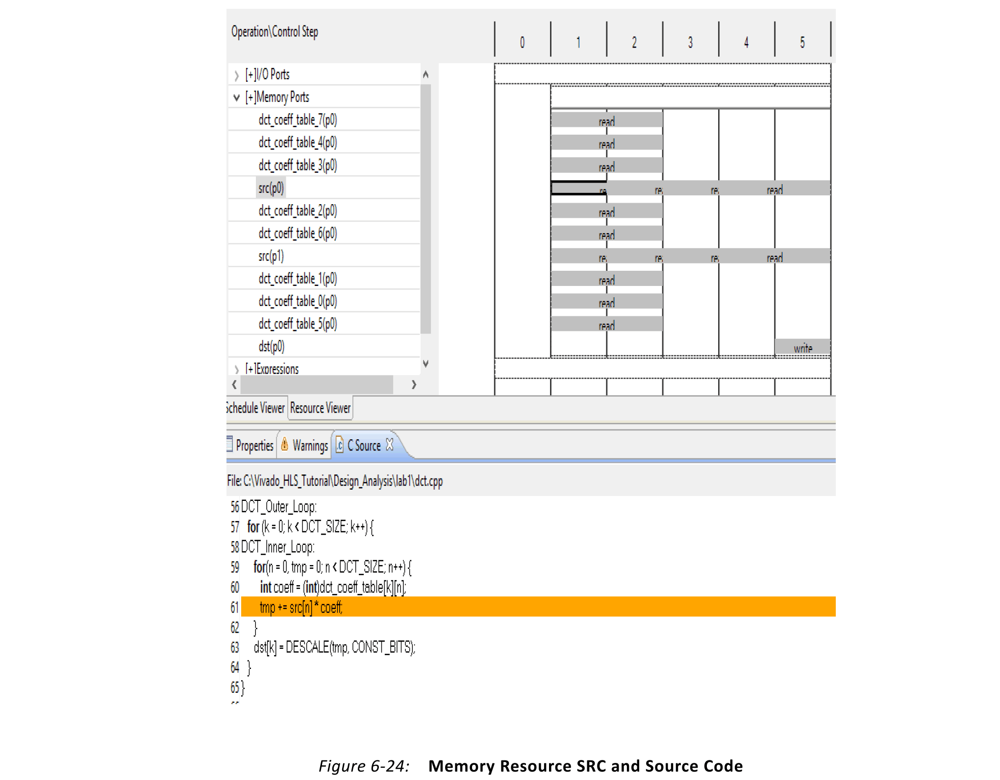

图6-24显示了对src变量的读取来自循环DCT_Inner_Loop内的读取操作。当对DCT_Outer_Loop进行流水线传输时，将自动展开此循环，并且此循环中的所有操作都可以并行发生（如果数据依赖允许的话）。

由于数组src在RTL中被实现为Block RAM，而Block RAM在任何一个时钟周期内只能允许两次读取（最大），**因此必须在多个周期内进行八次读取**。在图6-24中，读取操作需要2个时钟周期：一个为Block RAM生成地址的周期，另一个为读取数据的周期。仅显示启动（地址生成周期），因为它与下一个时钟周期中的操作重叠。

您可以使用优化指令对Block RAM进行优化，以**对Block RAM进行分区**。函数dct_1d访问的数组被定义为函数的输入参数，因此位于该块之外。
- dct函数中的dct_1d第一个实例的输入数组是buf_2d_in。
- dct_1d的第二个实例的输入数组是函数dct_2d中的col_inbuf。

在这两种情况下，数组都是二维的，大小为DCT_SIZE x DCT_SIZE（8x8）。默认情况下，这将导致具有64个元素的单个Block RAM。因为数组是在代码中以逐列的形式配置的，所以我们可以对第二维进行分区，并创建八个单独的Block RAM：每个行一个RAM，允许并行访问行数据。

#### 我的分析
- Step0: 与之前solution做比较
  
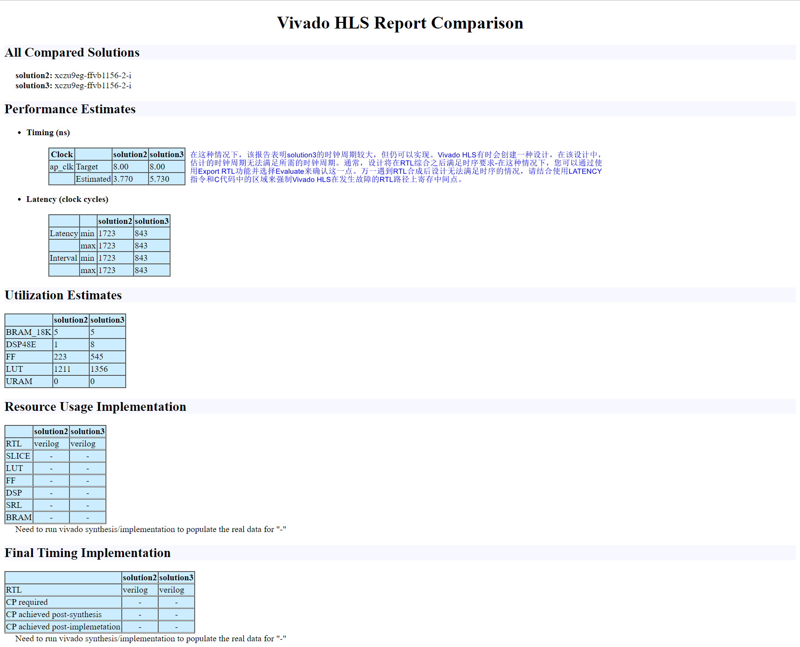

- Step1: 第一层分析

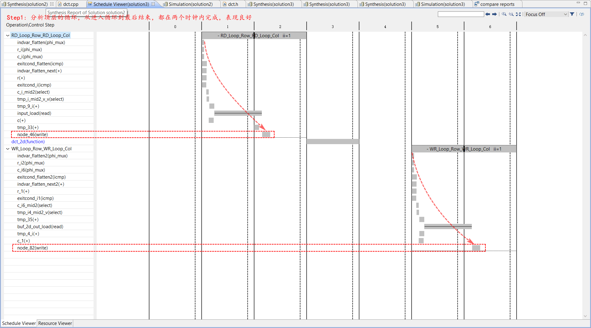

- Step2: 第二层分析

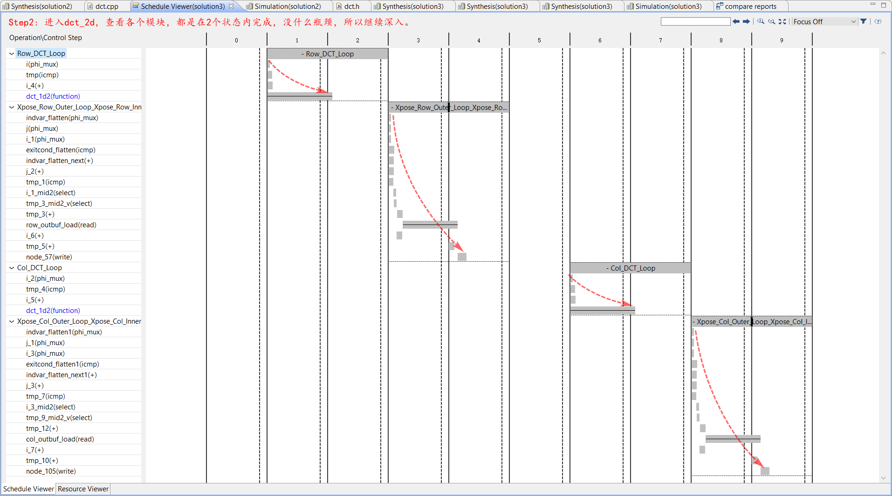

- Step3: 第三层分析

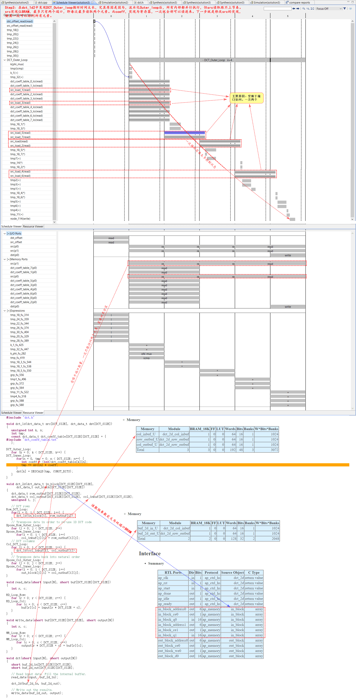

### Step 7: Partition Block RAMs and Analyze Concurrency

#### 代码配置

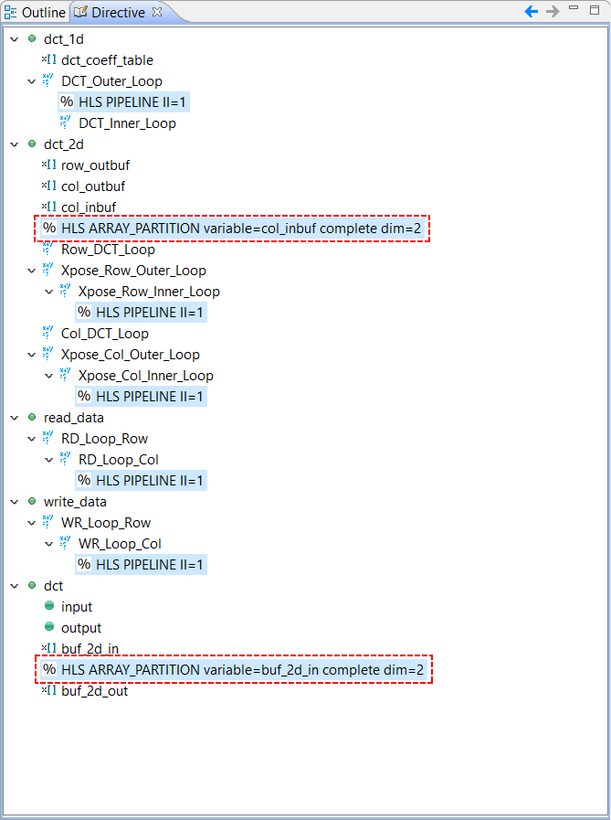

#### 瓶颈分析

您可以查看分区指令对设备资源的影响。

1. 单击Analysis透视图按钮开始交互式设计分析。
2. 在“Module Hierarchy”中，确保已选择模块dct。
3.  选择左下方的“Resource Profile”选项卡。
4.  展开存储器和表达式，请参见图6-27中的视图。


资源配置文件显示当前dct在层次结构级别（在“模块层次结构”窗格中选择的块）使用的资源。图6-27显示：
- 该块具有两个I/O端口。
- 大部分面积归因于该块内的实例（子块）。
- 有9个存储器，其中8个是分区的buf_2d_in Block RAM。由于它们少于1024位，因此它们会自动实现为LUTRAM。
- 在此层次结构级别上的大多数逻辑（表达式）是由于加法器引起的，有些是由于比较器和选择器引起的。

先前优化的重点在于，由于数组分区优化，您现在可以看到更多的内存。

您仍然有一个目标，就是确保设计能够每125个时钟周期接受一组新的采样。但是，综合报告显示，您只能每477个时钟接收一次新数据。这比原始的预先优化的设计（大约2600个时钟周期）要好得多，但是还需要进一步的优化。

到目前为止，您已集中精力改善设计中每个单独循环和函数的延迟和间隔。现在，**您必须应用dataflow优化**，这可以使各个循环和功能并行执行，从而缩短了总体设计间隔。

#### 我的分析


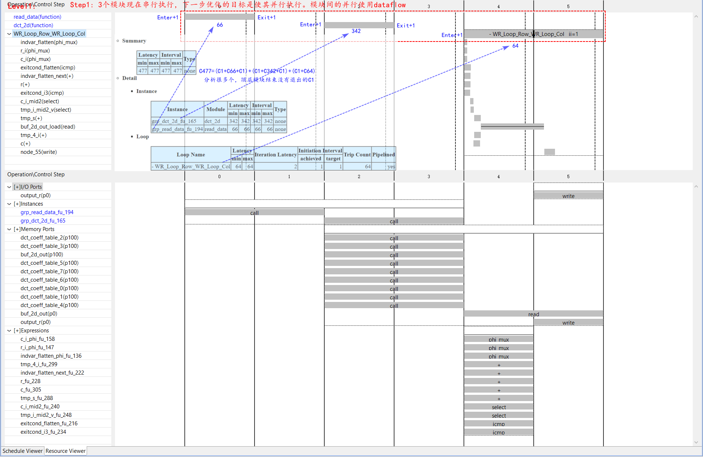

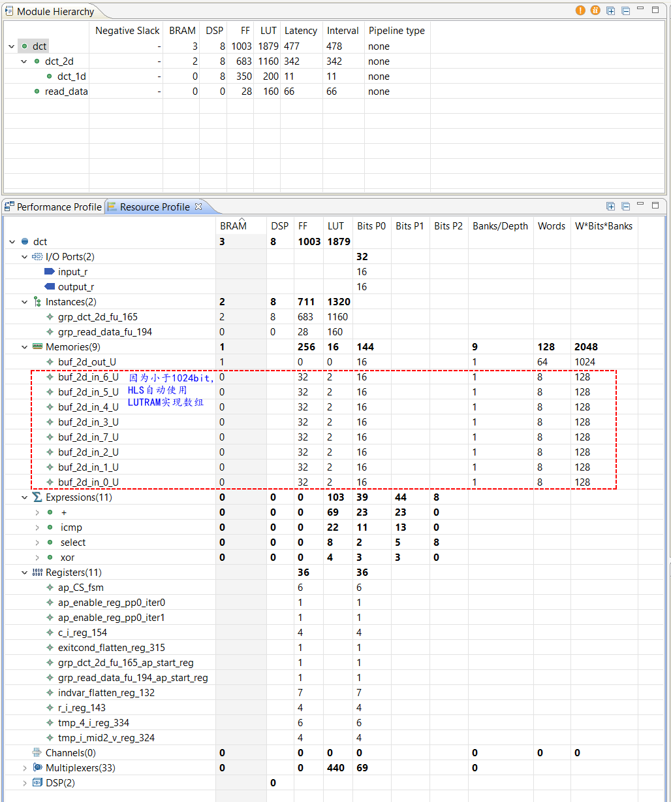

### Step 8: Partition Block RAMs and Apply Dataflow optimization

#### 代码配置

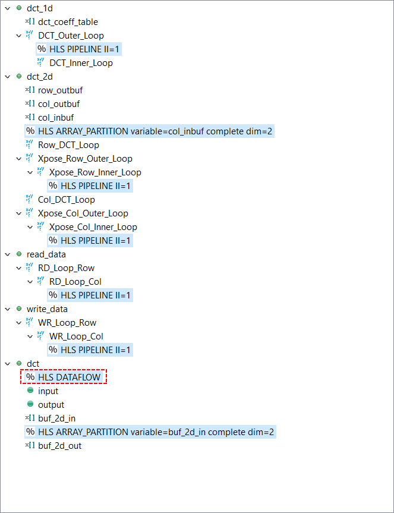

#### 瓶颈分析

7. 单击Analysis透视图按钮开始交互式设计分析。
8. 在“Module Hierarchy”中，您可以看到`dct_2d`占了大部分时间间隔。

确保选择模块`dct_2d`以查看图6-30的视图。

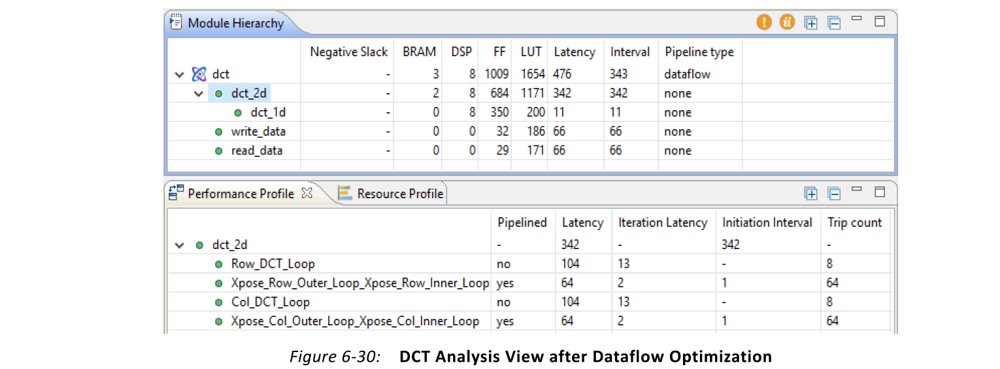

在这里，您可以看到两件事：
- **dct块的间隔小于各个延迟的总和**（read_data，dct_2d和write_data）。这意味着这些块**并行运行**。
- dct的间隔与子块dct_2d的间隔几乎相同。因此，**dct_2d块是限制因素**。

由于在模块层次结构中选择了dct_2d块，因此性能概要文件显示了该块的详细信息。图6-31显示了**该间隔与Latency相同，因此这些块均不能并行运行**。

使dct_2d中的块并行运行的一种方法是**对整个函数进行流水线处理**。但是，这将展开所有循环，有时可能导致大面积增加。一种替代方法是在函数dct_2d上使用**数据流优化**。

另一种选择是使用不太明显的技术：将这些循环**提升到层次结构的顶层**，在此将它们包含在已经应用于顶层的数据流优化中。这可以通过使用优化指令删除dct_2d层次结构来实现：**内联dct_2d函数**。

在执行此优化之前，请查看由于使用数据流优化而导致的面积增加。


#### 我的分析

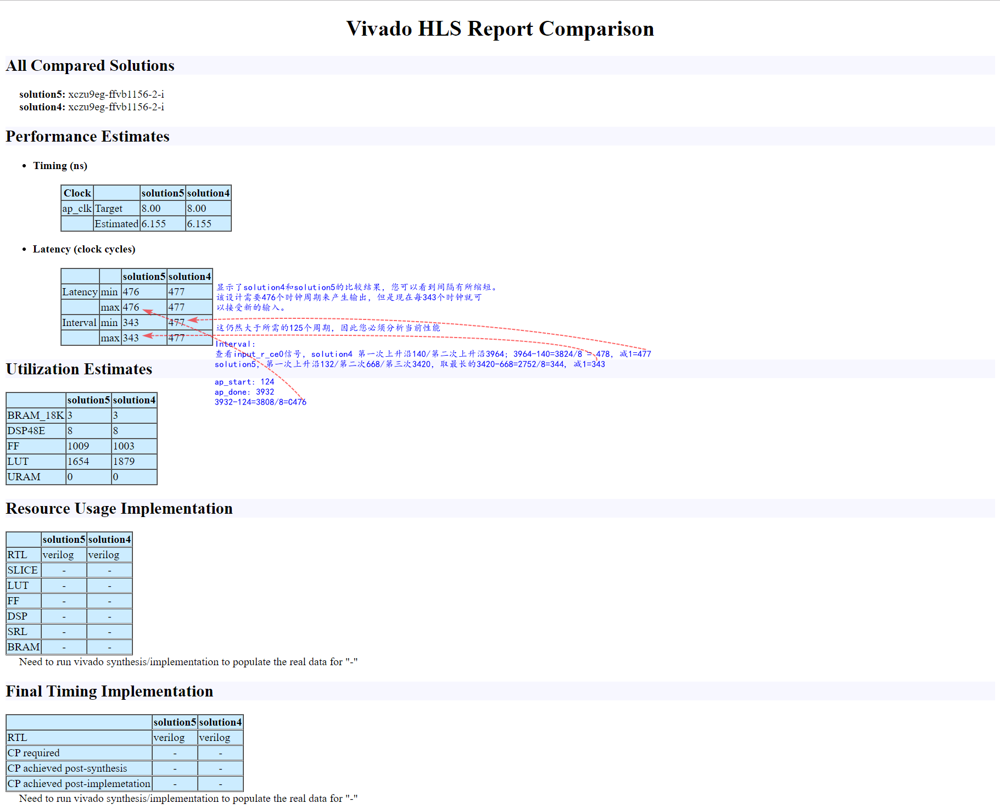


### Step 9: Optimize the Hierarchy for Dataflow 

#### 我的分析

因为已经使用了dataflow，所以每个模块只需要分析第一次发生的ap_start即可。


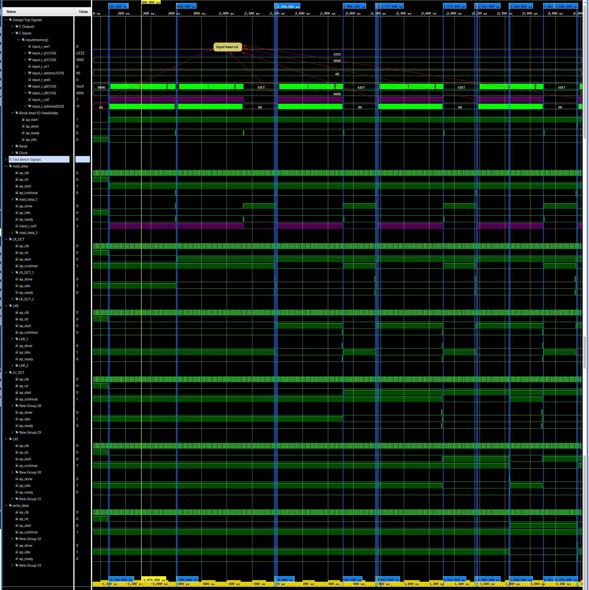

### Summary

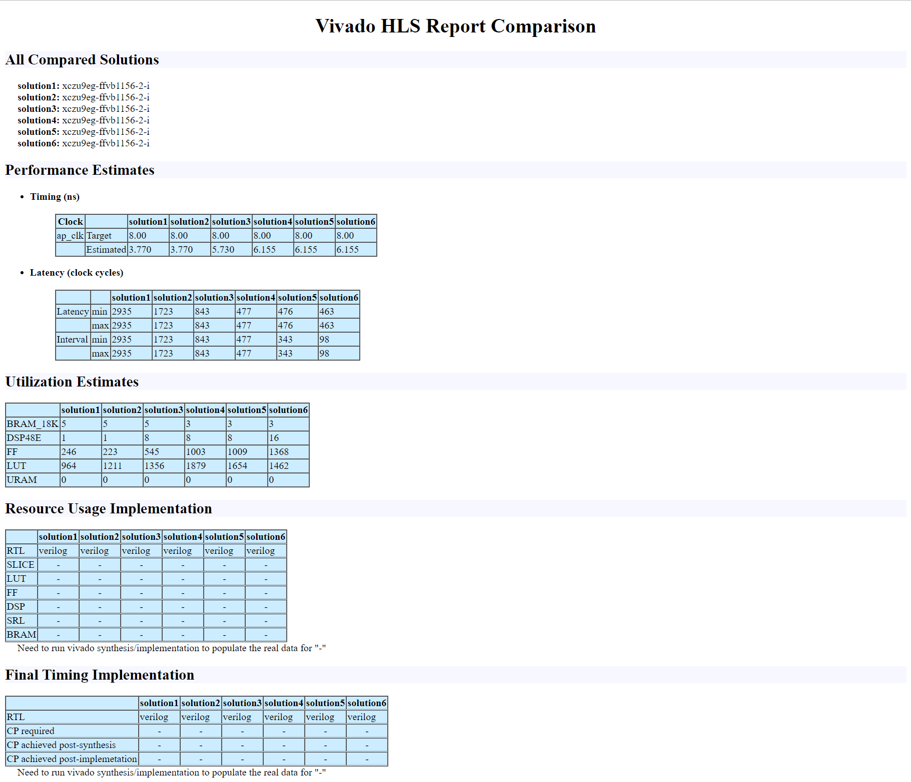