# Ch7 Design Optimization
使用高级综合创建高质量RTL设计的关键部分是能够对C代码进行优化。**高级综合总是试图最小化循环和函数的延迟**。为此，在循环和函数中，它**尝试并行执行尽可能多的操作**。在函数级别，高级综合**总是尝试并行执行函数**。

除了这些自动优化之外，指令还用于：
- 并行执行多个任务，例如，同一函数的多次执行或同一循环的多次迭代。这是流水线。
- 重组数组（块RAM），函数，循环和端口的物理实现，以提高数据的可用性并帮助数据更快地通过设计。
- 提供有关数据依赖性的信息，或缺少数据依赖性，从而可以执行更多优化。

**最终的优化技术是修改C源代码，以消除可能会限制硬件性能的代码中意外的依赖关系**。

本教程包含两个实验练习。您可以使用“分析”透视图在这些实验练习中执行分析。本教程的前提条件是完成第6章“设计分析”教程。

## Lab 1: Optimizing a Matrix Multiplier
本练习使用矩阵乘法器设计来展示如何基于循环充分优化设计。设计目标是使用FIFO接口在每个时钟周期读取一个样本，同时使面积最小。

分析包括对在循环级别进行优化的方法与在函数级别进行优化的方法的比较。

### Step 1: Create and Open the Project

```tcl
D:\workspace\study\FPGA\HLS\Xilinx\UG871\ug871-design-files\Design_Optimization\lab1>vivado_hls -f run_hls.tcl

****** Vivado(TM) HLS - High-Level Synthesis from C, C++ and SystemC v2018.3 (64-bit)
  **** SW Build 2405991 on Thu Dec  6 23:38:27 MST 2018
  **** IP Build 2404404 on Fri Dec  7 01:43:56 MST 2018
    ** Copyright 1986-2018 Xilinx, Inc. All Rights Reserved.

source C:/Xilinx/Vivado/2018.3/scripts/vivado_hls/hls.tcl -notrace
INFO: [HLS 200-10] Running 'C:/Xilinx/Vivado/2018.3/bin/unwrapped/win64.o/vivado_hls.exe'
INFO: [HLS 200-10] For user 'skd22' on host 'desktop-cl29dn1' (Windows NT_amd64 version 6.2) on Fri Nov 29 10:13:08 +0800 2019
INFO: [HLS 200-10] In directory 'D:/workspace/study/FPGA/HLS/Xilinx/UG871/ug871-design-files/Design_Optimization/lab1'
INFO: [HLS 200-10] Creating and opening project 'D:/workspace/study/FPGA/HLS/Xilinx/UG871/ug871-design-files/Design_Optimization/lab1/matrixmul_prj'.
INFO: [HLS 200-10] Adding design file 'matrixmul.cpp' to the project
INFO: [HLS 200-10] Adding test bench file 'matrixmul_test.cpp' to the project
INFO: [HLS 200-10] Creating and opening solution 'D:/workspace/study/FPGA/HLS/Xilinx/UG871/ug871-design-files/Design_Optimization/lab1/matrixmul_prj/solution1'.
INFO: [HLS 200-10] Cleaning up the solution database.
INFO: [HLS 200-10] Setting target device to 'xczu9eg-ffvb1156-2-i'
INFO: [SYN 201-201] Setting up clock 'default' with a period of 13.333ns.
INFO: [SIM 211-2] *************** CSIM start ***************
INFO: [SIM 211-4] CSIM will launch GCC as the compiler.
   Compiling ../../../../matrixmul_test.cpp in debug mode
   Compiling ../../../../matrixmul.cpp in debug mode
   Generating csim.exe
Test passes.
INFO: [SIM 211-1] CSim done with 0 errors.
INFO: [SIM 211-3] *************** CSIM finish ***************
INFO: [Common 17-206] Exiting vivado_hls at Fri Nov 29 10:13:12 2019...
D:\workspace\study\FPGA\HLS\Xilinx\UG871\ug871-design-files\Design_Optimization\lab1>vivado_hls -p matrixmul_prj

****** Vivado(TM) HLS - High-Level Synthesis from C, C++ and SystemC v2018.3 (64-bit)
  **** SW Build 2405991 on Thu Dec  6 23:38:27 MST 2018
  **** IP Build 2404404 on Fri Dec  7 01:43:56 MST 2018
    ** Copyright 1986-2018 Xilinx, Inc. All Rights Reserved.

source C:/Xilinx/Vivado/2018.3/scripts/vivado_hls/hls.tcl -notrace
INFO: [HLS 200-10] Running 'C:/Xilinx/Vivado/2018.3/bin/unwrapped/win64.o/vivado_hls.exe'
INFO: [HLS 200-10] For user 'skd22' on host 'desktop-cl29dn1' (Windows NT_amd64 version 6.2) on Fri Nov 29 10:13:33 +0800 2019
INFO: [HLS 200-10] In directory 'D:/workspace/study/FPGA/HLS/Xilinx/UG871/ug871-design-files/Design_Optimization/lab1'
INFO: [HLS 200-10] Bringing up Vivado HLS GUI ...
```

- matrixmul.h

```c++
#ifndef __MATRIXMUL_H__
#define __MATRIXMUL_H__

#include <cmath>
using namespace std;

// Compare TB vs HW C-model and/or RTL
#define HW_COSIM

#define MAT_A_ROWS 3
#define MAT_A_COLS 3
#define MAT_B_ROWS 3
#define MAT_B_COLS 3

typedef char mat_a_t;
typedef char mat_b_t;
typedef short result_t;

// Prototype of top level function for C-synthesis
void matrixmul(
      mat_a_t a[MAT_A_ROWS][MAT_A_COLS],
      mat_b_t b[MAT_B_ROWS][MAT_B_COLS],
      result_t res[MAT_A_ROWS][MAT_B_COLS]);

#endif // __MATRIXMUL_H__ not defined
```

- matrixmul.cpp

```c++
#include "matrixmul.h"

void matrixmul(
      mat_a_t a[MAT_A_ROWS][MAT_A_COLS],
      mat_b_t b[MAT_B_ROWS][MAT_B_COLS],
      result_t res[MAT_A_ROWS][MAT_B_COLS])
{
  // Iterate over the rows of the A matrix
   Row: for(int i = 0; i < MAT_A_ROWS; i++) {
      // Iterate over the columns of the B matrix
      Col: for(int j = 0; j < MAT_B_COLS; j++) {
         res[i][j] = 0;
         // Do the inner product of a row of A and col of B
         Product: for(int k = 0; k < MAT_B_ROWS; k++) {
            res[i][j] += a[i][k] * b[k][j];
         }
      }
   }

}
```

### Step 2: Synthesize and Analyze the Design

综合完成后，综合报告将打开（图7-4），并出现“性能估计”：
- 间隔为80个时钟周期。由于每个输入数组中有九个元素，因此该设计每次读取输入大约需要九个周期。
- 时间间隔比延迟时间长一个周期，因此此时硬件中没有并行性。
- 延迟/间隔是由于嵌套循环引起的。
  - Product内部循环：
    - 具有2个时钟周期的延迟。
    - 所有迭代共有6个时钟周期。
  - Col循环：
    - 进入Product循环需要1个时钟，退出循环需要1个时钟。
    - 每次迭代（1 + 6 + 1）需要8个时钟周期。
    - 有24个时钟周期可完成所有迭代。
  - 顶层循环的每次迭代等待时间为26个时钟周期，对于该循环的所有迭代，总共有78个时钟周期。

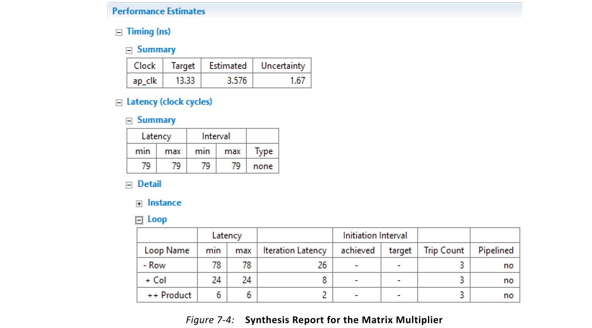

您可以执行以下两项操作之一来缩短启动间隔：对循环进行流水线处理或对整个函数进行流水线处理。您首先对循环进行流水线处理，然后将这些结果与对整个函数进行流水线比较。

在对循环进行流水线处理时，循环的启动间隔是要监视的重要指标。从本练习中可以看出，即使当设计达到循环可以在每个时钟周期处理一个样本的阶段时，该函数的启动间隔仍会报告为该函数中包含的循环完成处理所有数据所花费的时间。

#### 我的分析

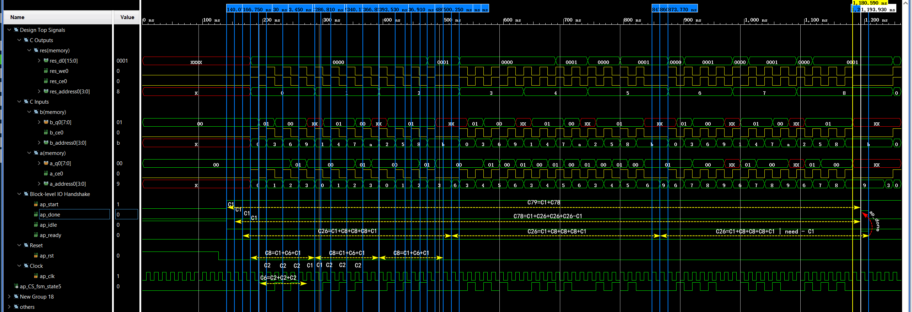

### Step 3: Pipeline the Product Loop

#### 代码修改


#### 瓶颈分析

- 综合

在综合期间，“控制台”窗格中报告的信息显示在循环行上执行了循环展平，并且由于依赖关系，无法在Product循环上实现默认的初始化内部目标1。

```tcl
Starting C synthesis ...
C:/Xilinx/Vivado/2018.3/bin/vivado_hls.bat D:/workspace/study/FPGA/HLS/Xilinx/UG871/ug871-design-files/Design_Optimization/lab1/matrixmul_prj/solution2/csynth.tcl
INFO: [HLS 200-10] Running 'C:/Xilinx/Vivado/2018.3/bin/unwrapped/win64.o/vivado_hls.exe'
INFO: [HLS 200-10] For user 'skd22' on host 'desktop-cl29dn1' (Windows NT_amd64 version 6.2) on Fri Nov 29 14:33:32 +0800 2019
INFO: [HLS 200-10] In directory 'D:/workspace/study/FPGA/HLS/Xilinx/UG871/ug871-design-files/Design_Optimization/lab1'
INFO: [HLS 200-10] Opening project 'D:/workspace/study/FPGA/HLS/Xilinx/UG871/ug871-design-files/Design_Optimization/lab1/matrixmul_prj'.
INFO: [HLS 200-10] Adding design file 'matrixmul.cpp' to the project
INFO: [HLS 200-10] Adding test bench file 'matrixmul_test.cpp' to the project
INFO: [HLS 200-10] Opening solution 'D:/workspace/study/FPGA/HLS/Xilinx/UG871/ug871-design-files/Design_Optimization/lab1/matrixmul_prj/solution2'.
INFO: [SYN 201-201] Setting up clock 'default' with a period of 13.333ns.
INFO: [HLS 200-10] Setting target device to 'xczu9eg-ffvb1156-2-i'
INFO: [SCHED 204-61] Option 'relax_ii_for_timing' is enabled, will increase II to preserve clock frequency constraints.
INFO: [HLS 200-10] Analyzing design file 'matrixmul.cpp' ... 
INFO: [HLS 200-111] Finished Linking Time (s): cpu = 00:00:01 ; elapsed = 00:00:05 . Memory (MB): peak = 103.406 ; gain = 18.164
INFO: [HLS 200-111] Finished Checking Pragmas Time (s): cpu = 00:00:01 ; elapsed = 00:00:05 . Memory (MB): peak = 103.406 ; gain = 18.164
INFO: [HLS 200-10] Starting code transformations ...
INFO: [HLS 200-111] Finished Standard Transforms Time (s): cpu = 00:00:01 ; elapsed = 00:00:05 . Memory (MB): peak = 104.980 ; gain = 19.738
INFO: [HLS 200-10] Checking synthesizability ...
INFO: [HLS 200-111] Finished Checking Synthesizability Time (s): cpu = 00:00:01 ; elapsed = 00:00:05 . Memory (MB): peak = 105.234 ; gain = 19.992
INFO: [HLS 200-111] Finished Pre-synthesis Time (s): cpu = 00:00:01 ; elapsed = 00:00:05 . Memory (MB): peak = 126.617 ; gain = 41.375

以下警告：因为res的读写依赖关系，无法展平
WARNING: [XFORM 203-542] Cannot flatten a loop nest 'Col' (matrixmul.cpp:56:40) in function 'matrixmul' : 

the outer loop is not a perfect loop.
INFO: [XFORM 203-541] Flattening a loop nest 'Row' (matrixmul.cpp:54:37) in function 'matrixmul'.
INFO: [HLS 200-111] Finished Architecture Synthesis Time (s): cpu = 00:00:01 ; elapsed = 00:00:05 . Memory (MB): peak = 126.617 ; gain = 41.375
INFO: [HLS 200-10] Starting hardware synthesis ...
INFO: [HLS 200-10] Synthesizing 'matrixmul' ...
INFO: [HLS 200-10] ----------------------------------------------------------------
INFO: [HLS 200-42] -- Implementing module 'matrixmul' 
INFO: [HLS 200-10] ----------------------------------------------------------------
INFO: [SCHED 204-11] Starting scheduling ...
INFO: [SCHED 204-61] Pipelining loop 'Product'.
WARNING: [SCHED 204-68] The II Violation in module 'matrixmul': Unable to enforce a carried dependence constraint (II = 1, distance = 1, offset = 1)
   between 'store' operation (matrixmul.cpp:60) of variable 'tmp_8', matrixmul.cpp:60 on array 'res' and 'load' operation ('res_load', matrixmul.cpp:60) on array 'res'.


INFO: [SCHED 204-61] Pipelining result : Target II = 1, Final II = 2, Depth = 2.
INFO: [SCHED 204-11] Finished scheduling.
INFO: [HLS 200-111]  Elapsed time: 5.342 seconds; current allocated memory: 77.492 MB.
INFO: [HLS 200-434] Only 1 loops out of a total 2 loops have been pipelined in this design.
INFO: [BIND 205-100] Starting micro-architecture generation ...
INFO: [BIND 205-101] Performing variable lifetime analysis.
INFO: [BIND 205-101] Exploring resource sharing.
INFO: [BIND 205-101] Binding ...
INFO: [BIND 205-100] Finished micro-architecture generation.
INFO: [HLS 200-111]  Elapsed time: 0.101 seconds; current allocated memory: 77.801 MB.
INFO: [HLS 200-10] ----------------------------------------------------------------
INFO: [HLS 200-10] -- Generating RTL for module 'matrixmul' 
INFO: [HLS 200-10] ----------------------------------------------------------------
INFO: [RTGEN 206-500] Setting interface mode on port 'matrixmul/a' to 'ap_memory'.
INFO: [RTGEN 206-500] Setting interface mode on port 'matrixmul/b' to 'ap_memory'.
INFO: [RTGEN 206-500] Setting interface mode on port 'matrixmul/res' to 'ap_memory'.
INFO: [RTGEN 206-500] Setting interface mode on function 'matrixmul' to 'ap_ctrl_hs'.
INFO: [SYN 201-210] Renamed object name 'matrixmul_mac_muladd_8s_8s_16ns_16_1_1' to 'matrixmul_mac_mulbkb' due to the length limit 20
INFO: [RTGEN 206-100] Generating core module 'matrixmul_mac_mulbkb': 1 instance(s).
INFO: [RTGEN 206-100] Finished creating RTL model for 'matrixmul'.
INFO: [HLS 200-111]  Elapsed time: 0.132 seconds; current allocated memory: 78.182 MB.
INFO: [HLS 200-111] Finished generating all RTL models Time (s): cpu = 00:00:02 ; elapsed = 00:00:07 . Memory (MB): peak = 126.617 ; gain = 41.375
INFO: [SYSC 207-301] Generating SystemC RTL for matrixmul.
INFO: [VHDL 208-304] Generating VHDL RTL for matrixmul.
INFO: [VLOG 209-307] Generating Verilog RTL for matrixmul.
INFO: [HLS 200-112] Total elapsed time: 6.725 seconds; peak allocated memory: 78.182 MB.
Finished C synthesis.

```

综合报告（图7-6）显示，尽管Product循环以2的间隔流水化，但顶层循环的间隔没有流水化。


顶层循环没有流水线的原因是**循环展平仅发生在循环Row_Col上**。没有将循环Col的循环展平到Product循环中。要了解为什么循环展平无法展平所有嵌套循环，请使用“分析”透视图。

6. 打开分析透视图。
7. 在Performance View中，展开循环Row_Col和Product。
8. 在状态C1中选择写操作。
9. 右键单击并选择Goto Source，以查看图7-7中的视图。

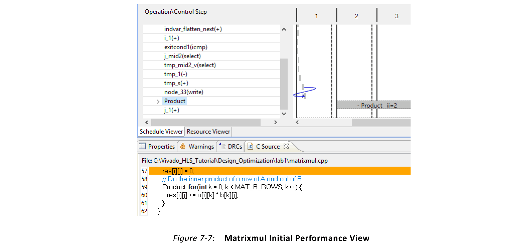

状态C1中的写操作归因于在Product循环之前将res设置为零的代码。由于res是顶层函数参数，因此**它是对RTL中端口的写操作：此操作必须在执行循环Product中的操作之前发生**。因为它不是内部操作，但会影响I/O行为，因此无法移动或优化此操作。这样就阻止了将Product循环展平为Row_Col循环。【注：无法展平的原因】
```
WARNING: [XFORM 203-542] Cannot flatten a loop nest 'Col' (matrixmul.cpp:56:40) in function 'matrixmul' : 
the outer loop is not a perfect loop.
```
更重要的是，有必要解决为何Product循环的初始化间隔（II）只有2的原因（如图7-6所示）。控制台窗格中的消息SCHED-68（和文件vivado_hls.log）告诉您： 【注：流水化的product II为2的原因】
```
INFO: [SCHED 204-11] Starting scheduling ...
INFO: [SCHED 204-61] Pipelining loop 'Product'.
WARNING: [SCHED 204-68] The II Violation in module 'matrixmul': Unable to enforce a carried dependence constraint (II = 1, distance = 1, offset = 1)
   between 'store' operation (matrixmul.cpp:60) of variable 'tmp_8', matrixmul.cpp:60 on array 'res' and 'load' operation ('res_load', matrixmul.cpp:60) on array 'res'.


INFO: [SCHED 204-61] Pipelining result : Target II = 1, Final II = 2, Depth = 2.
INFO: [SCHED 204-11] Finished scheduling.
```

- 问题是携带的依赖关系。这是循环的一次迭代中的操作与同一循环的不同迭代中的操作之间的依赖关系。例如，当k = 1且k = 2时的操作（其中k是循环索引）。
- 第一个操作是第60行上数组res上的load（内存读取操作）。
- 第二个操作是第60行上数组res上的store（内存写操作）。

从图7-8中可以看到，第60行是从数组res读取（由于+ =运算符）和向数组res写入。默认情况下，数组映射到Block RAM，并且“性能视图”中的详细信息可以显示发生此冲突的原因。

“性能”视图显示在哪些状态下的操作被调度。图7-8显示其中两个操作是II违规的原因。这些操作在循环迭代之间具有依赖性。分析视图提供了将分析视图过滤到导致II违规的操作的功能。要使用此功能，请在过滤器下拉组合框中选择II Violation。

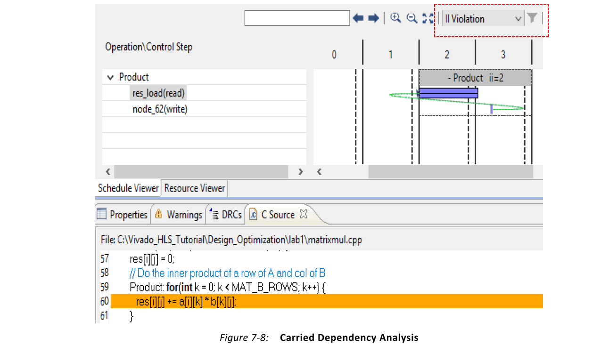

循环的第一次迭代显示了操作发生的状态。在状态2和3读取，以及在状态3写入。下一次迭代的操作必须在此之后的1个周期开始，因为在第一次写操作完成之前才能进行第二次读操作：循环的每次迭代都使用不同的地址，并且一次只能应用1个地址。

您不能以1的启动间隔对Product循环进行流水化。下一个实验练习显示了重新编写代码如何可以消除此限制。在本实验练习中，您将继续按原样优化代码。

下一步是对上面的循环Col循环进行流水线处理。这将自动展开Product循环并创建更多的运算符，从而创建更多的硬件资源，但是它确保Product循环的不同迭代之间没有依赖性。

#### 我的分析


### Step 4: Pipeline the Col Loop

#### 代码修改


#### 瓶颈分析

```tcl
C:/Xilinx/Vivado/2018.3/bin/vivado_hls.bat D:/workspace/study/FPGA/HLS/Xilinx/UG871/ug871-design-files/Design_Optimization/lab1/matrixmul_prj/solution3/csynth.tcl
INFO: [HLS 200-10] Running 'C:/Xilinx/Vivado/2018.3/bin/unwrapped/win64.o/vivado_hls.exe'
INFO: [HLS 200-10] For user 'skd22' on host 'desktop-cl29dn1' (Windows NT_amd64 version 6.2) on Fri Nov 29 16:35:56 +0800 2019
INFO: [HLS 200-10] In directory 'D:/workspace/study/FPGA/HLS/Xilinx/UG871/ug871-design-files/Design_Optimization/lab1'
INFO: [HLS 200-10] Opening project 'D:/workspace/study/FPGA/HLS/Xilinx/UG871/ug871-design-files/Design_Optimization/lab1/matrixmul_prj'.
INFO: [HLS 200-10] Adding design file 'matrixmul.cpp' to the project
INFO: [HLS 200-10] Adding test bench file 'matrixmul_test.cpp' to the project
INFO: [HLS 200-10] Opening solution 'D:/workspace/study/FPGA/HLS/Xilinx/UG871/ug871-design-files/Design_Optimization/lab1/matrixmul_prj/solution3'.
INFO: [SYN 201-201] Setting up clock 'default' with a period of 13.333ns.
INFO: [HLS 200-10] Setting target device to 'xczu9eg-ffvb1156-2-i'
INFO: [SCHED 204-61] Option 'relax_ii_for_timing' is enabled, will increase II to preserve clock frequency constraints.
INFO: [HLS 200-10] Analyzing design file 'matrixmul.cpp' ... 
INFO: [HLS 200-111] Finished Linking Time (s): cpu = 00:00:01 ; elapsed = 00:00:05 . Memory (MB): peak = 103.449 ; gain = 17.953
INFO: [HLS 200-111] Finished Checking Pragmas Time (s): cpu = 00:00:01 ; elapsed = 00:00:05 . Memory (MB): peak = 103.449 ; gain = 17.953
INFO: [HLS 200-10] Starting code transformations ...
INFO: [HLS 200-111] Finished Standard Transforms Time (s): cpu = 00:00:01 ; elapsed = 00:00:05 . Memory (MB): peak = 104.984 ; gain = 19.488
INFO: [HLS 200-10] Checking synthesizability ...
INFO: [HLS 200-111] Finished Checking Synthesizability Time (s): cpu = 00:00:01 ; elapsed = 00:00:05 . Memory (MB): peak = 104.984 ; gain = 19.488
INFO: [XFORM 203-502] Unrolling all sub-loops inside loop 'Col' (matrixmul.cpp:56) in function 'matrixmul' for pipelining.
INFO: [HLS 200-489] Unrolling loop 'Product' (matrixmul.cpp:59) in function 'matrixmul' completely with a factor of 3.
INFO: [HLS 200-111] Finished Pre-synthesis Time (s): cpu = 00:00:01 ; elapsed = 00:00:05 . Memory (MB): peak = 126.582 ; gain = 41.086
INFO: [XFORM 203-541] Flattening a loop nest 'Row' (matrixmul.cpp:54:37) in function 'matrixmul'.
INFO: [HLS 200-111] Finished Architecture Synthesis Time (s): cpu = 00:00:01 ; elapsed = 00:00:05 . Memory (MB): peak = 126.582 ; gain = 41.086
INFO: [HLS 200-10] Starting hardware synthesis ...
INFO: [HLS 200-10] Synthesizing 'matrixmul' ...
INFO: [HLS 200-10] ----------------------------------------------------------------
INFO: [HLS 200-42] -- Implementing module 'matrixmul' 
INFO: [HLS 200-10] ----------------------------------------------------------------
INFO: [SCHED 204-11] Starting scheduling ...
INFO: [SCHED 204-61] Pipelining loop 'Row_Col'.
WARNING: [SCHED 204-69] Unable to schedule 'load' operation ('a_load_2', matrixmul.cpp:60) on array 'a' due to limited memory ports. Please consider using a memory core with more ports or partitioning the array 'a'.
INFO: [SCHED 204-61] Pipelining result : Target II = 1, Final II = 2, Depth = 4.
INFO: [SCHED 204-11] Finished scheduling.
INFO: [HLS 200-111]  Elapsed time: 5.285 seconds; current allocated memory: 77.712 MB.
INFO: [BIND 205-100] Starting micro-architecture generation ...
INFO: [BIND 205-101] Performing variable lifetime analysis.
INFO: [BIND 205-101] Exploring resource sharing.
INFO: [BIND 205-101] Binding ...
INFO: [BIND 205-100] Finished micro-architecture generation.
INFO: [HLS 200-111]  Elapsed time: 0.101 seconds; current allocated memory: 77.949 MB.
INFO: [HLS 200-10] ----------------------------------------------------------------
INFO: [HLS 200-10] -- Generating RTL for module 'matrixmul' 
INFO: [HLS 200-10] ----------------------------------------------------------------
INFO: [RTGEN 206-500] Setting interface mode on port 'matrixmul/a' to 'ap_memory'.
INFO: [RTGEN 206-500] Setting interface mode on port 'matrixmul/b' to 'ap_memory'.
INFO: [RTGEN 206-500] Setting interface mode on port 'matrixmul/res' to 'ap_memory'.
INFO: [RTGEN 206-500] Setting interface mode on function 'matrixmul' to 'ap_ctrl_hs'.
INFO: [SYN 201-210] Renamed object name 'matrixmul_mac_muladd_8s_8s_16ns_16_1_1' to 'matrixmul_mac_mulbkb' due to the length limit 20
INFO: [SYN 201-210] Renamed object name 'matrixmul_mac_muladd_8s_8s_16s_16_1_1' to 'matrixmul_mac_mulcud' due to the length limit 20
INFO: [RTGEN 206-100] Generating core module 'matrixmul_mac_mulbkb': 1 instance(s).
INFO: [RTGEN 206-100] Generating core module 'matrixmul_mac_mulcud': 1 instance(s).
INFO: [RTGEN 206-100] Finished creating RTL model for 'matrixmul'.
INFO: [HLS 200-111]  Elapsed time: 0.156 seconds; current allocated memory: 78.462 MB.
INFO: [HLS 200-111] Finished generating all RTL models Time (s): cpu = 00:00:02 ; elapsed = 00:00:07 . Memory (MB): peak = 127.301 ; gain = 41.805
INFO: [SYSC 207-301] Generating SystemC RTL for matrixmul.
INFO: [VHDL 208-304] Generating VHDL RTL for matrixmul.
INFO: [VLOG 209-307] Generating Verilog RTL for matrixmul.
INFO: [HLS 200-112] Total elapsed time: 6.859 seconds; peak allocated memory: 78.462 MB.
Finished C synthesis.
```

合成期间，控制台窗格中报告的信息显示已展开循环产品，已在Row循环上执行了循环展平，并且由于数组a的内存资源有限，无法在循环Row_Col上实现默认的初始化内部目标1。

```tcl
INFO: [XFORM 203-502] Unrolling all sub-loops inside loop 'Col' (matrixmul.cpp:56) in function 'matrixmul' for pipelining.
INFO: [HLS 200-489] Unrolling loop 'Product' (matrixmul.cpp:59) in function 'matrixmul' completely with a factor of 3.
INFO: [HLS 200-111] Finished Pre-synthesis Time (s): cpu = 00:00:01 ; elapsed = 00:00:05 . Memory (MB): peak = 126.582 ; gain = 41.086
INFO: [XFORM 203-541] Flattening a loop nest 'Row' (matrixmul.cpp:54:37) in function 'matrixmul'.
INFO: [HLS 200-111] Finished Architecture Synthesis Time (s): cpu = 00:00:01 ; elapsed = 00:00:05 . Memory (MB): peak = 126.582 ; gain = 41.086
INFO: [HLS 200-10] Starting hardware synthesis ...
INFO: [HLS 200-10] Synthesizing 'matrixmul' ...
INFO: [HLS 200-10] ----------------------------------------------------------------
INFO: [HLS 200-42] -- Implementing module 'matrixmul' 
INFO: [HLS 200-10] ----------------------------------------------------------------
INFO: [SCHED 204-11] Starting scheduling ...
INFO: [SCHED 204-61] Pipelining loop 'Row_Col'.
WARNING: [SCHED 204-69] Unable to schedule 'load' operation ('a_load_2', matrixmul.cpp:60) on array 'a' due to limited memory ports. Please consider using a memory core with more ports or partitioning the array 'a'.
INFO: [SCHED 204-61] Pipelining result : Target II = 1, Final II = 2, Depth = 4.
INFO: [SCHED 204-11] Finished scheduling.
```

如上所述，查看综合报告显示，循环Row_Col的间隔只有两个：目标是每个循环处理一个样本。再一次，您可以使用“分析”透视图突出显示未达到启动目标的原因。

7. 打开分析透视图。
8. 在Performance View中，展开Row_Col循环 

图7-10中突出显示了数组a的操作（在上面的SCHED-69消息中提到）。数组a上有三个读取操作。在状态C1到C3的每个状态中执行一次操作。

数组被实现为Block RAM，而作为函数参数的数组则被实现为Block RAM端口。在这两种情况下，块RAM最多只能有两个端口（对于双端口块RAM）。通过单个Block RAM接口访问阵列a，**没有足够的端口能够在一个时钟周期内读取所有三个值**。

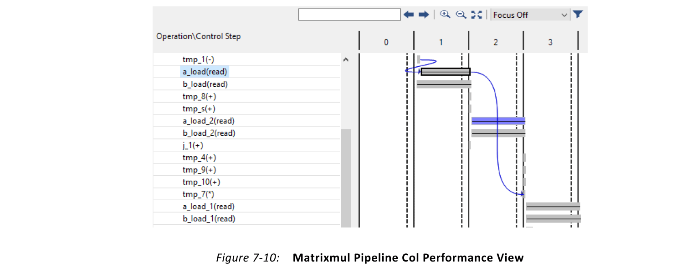

查看此资源限制的另一种方法是使用“资源”窗格。

9. 单击资源选项卡。
10. 展开“内存端口”以查看图7-11中所示的视图。

在图7-11中，状态C1中的2周期读取操作与状态C2中开始的操作重叠，因此仅一个周期可见：但是，很显然，**此资源在多个状态中使用**。

从该视图看，很明显，即使端口a的问题已解决，端口b也会发生相同的问题：它还必须执行3次读取。

高层综合一次只能报告一个调度错误或警告，因为一旦出现第一个问题，创建可实现调度的操作会使任何其他不可行的调度无效。


高级综合允许对数组进行分区，映射在一起并重新整形。这些技术允许在不更改源代码的情况下修改对数组的访问。

#### 我的分析

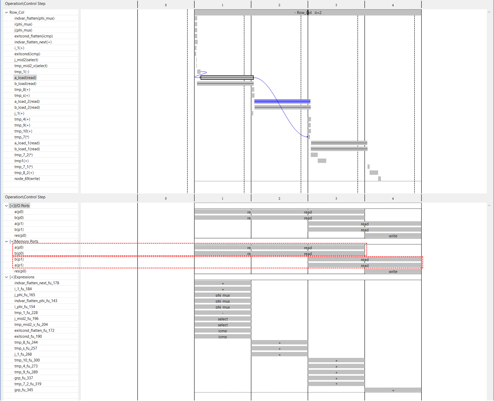

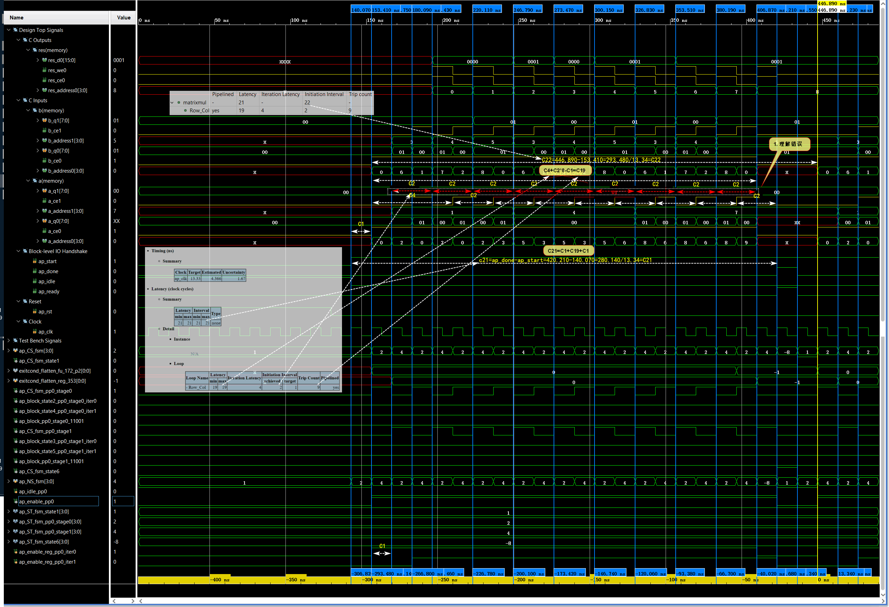

### Step 5: Reshape the Arrays

#### 代码修改

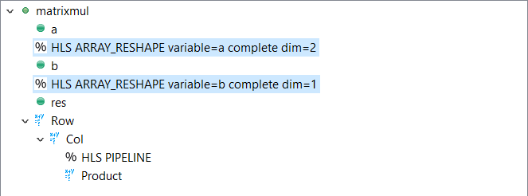

#### 瓶颈分析

综合报告显示，顶级循环Row_Col现在正在每个时钟周期以1个样本进行数据处理（图7-13）。

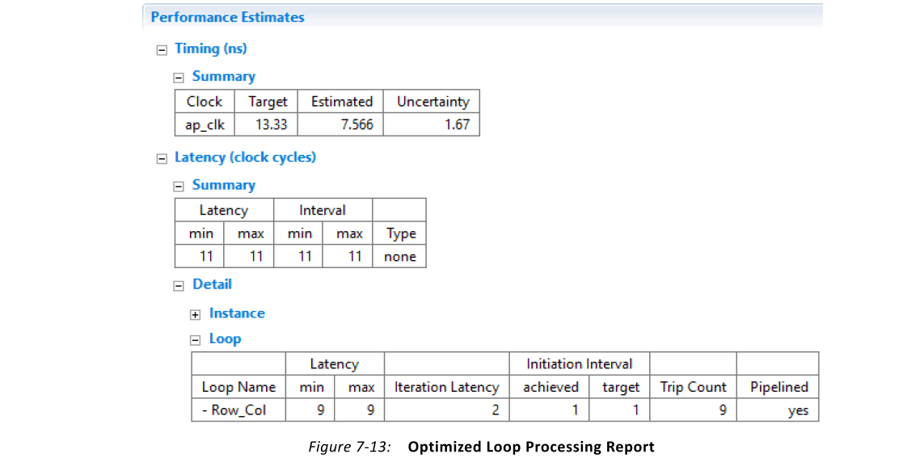

- 顶层模块需要11个时钟周期才能完成。
- Row_Col循环在2个周期（迭代等待时间）后输出一个样本。
- 然后，每个周期读取1个样本（启动间隔）。
- 9次迭代/采样（tripcount）后，它将完成所有采样。
- 2 + 9 = 11个时钟周期

然后，该函数可以完成并返回以开始处理下一组数据。

现在，将Block RAM接口更改为FIFO接口以允许流数据。

#### 我的分析

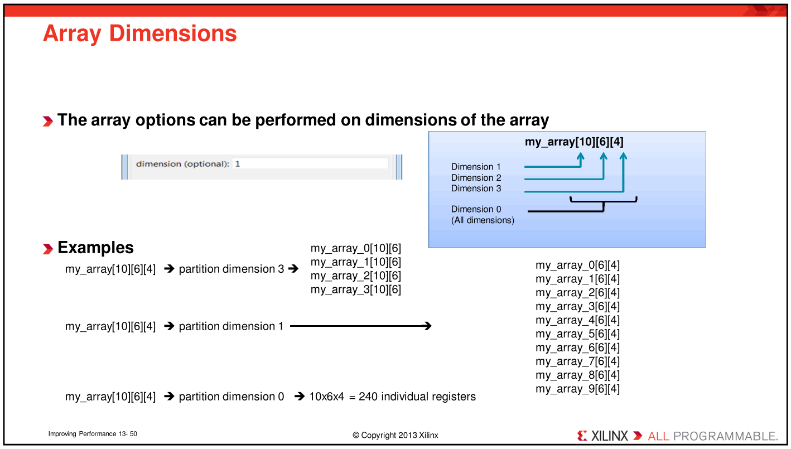

$$
A[i][k] = 
    \begin{bmatrix}
    & k_0 & k_1 & k_2 & \\ \hline
    i_0 & 0 & 0 & 1 & \rightarrow \\
    i_1 & 0 & 1 & 0 & \rightarrow \\
    i_2 & 1 & 0 & 0 & \rightarrow \\
    \end{bmatrix}
$$


$$
B[k][j] = 
    \begin{bmatrix}
    & j_0 & j_1 & j_2 & \\ \hline
    k_0 & 1 & 1 & 1 \\
    k_1 & 0 & 1 & 1 \\
    k_2 & 0 & 0 & 1 \\
    & \downarrow & \downarrow & \downarrow
    \end{bmatrix}
$$


$$
A[i_0]  = \begin{bmatrix} 0 & 0 & 1 \end{bmatrix} \rightarrow \begin{matrix} 01 & 00 & 00 \end{matrix} \\
A[i_1]  = \begin{bmatrix} 0 & 1 & 0 \end{bmatrix} \rightarrow \begin{matrix} 00 & 01 & 00 \end{matrix} \\
A[i_2]  = \begin{bmatrix} 1 & 0 & 0 \end{bmatrix} \rightarrow \begin{matrix} 00 & 00 & 01 \end{matrix} \\
$$

$$
B[j_0]  = \begin{bmatrix} 1 & 0 & 0 \end{bmatrix} \rightarrow \begin{matrix} 00 & 00 & 01 \end{matrix} \\
B[j_1]  = \begin{bmatrix} 1 & 1 & 0 \end{bmatrix} \rightarrow \begin{matrix} 00 & 01 & 01 \end{matrix} \\
B[j_2]  = \begin{bmatrix} 1 & 1 & 1 \end{bmatrix} \rightarrow \begin{matrix} 01 & 01 & 01 \end{matrix} \\
$$

$$ 
A[i][k] \cdot B[k][j] = \begin{bmatrix}
   0 & 0 & 1 \\
   0 & 1 & 0 \\
   1 & 0 & 0 \\
\end{bmatrix} \cdot \begin{bmatrix}
   1 & 1 & 1 \\
   0 & 1 & 1 \\
   0 & 0 & 1 \\
\end{bmatrix}
$$ 


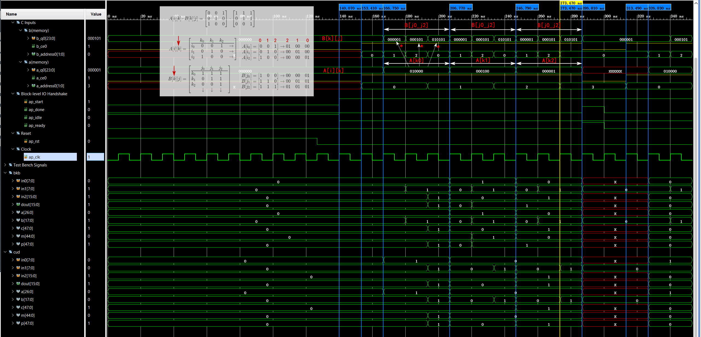

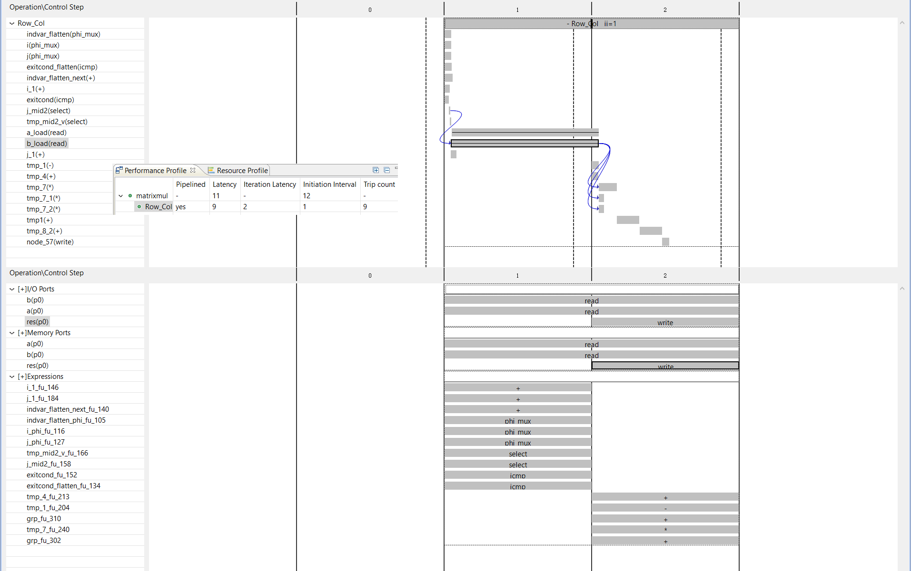

### Step 6: Apply FIFO Interfaces

#### 代码修改


#### 瓶颈分析

- 当综合时发生错误


从图7-16所示的代码中，数组res按以下顺序执行写操作（MAT_B_COLS = MAT_B_ROWS = 3）：
- Write to [0][0] on line57.
- Then a write to [0][0] on line 60.
- Then a write to [0][0] on line 60.
- Then a write to [0][0] on line 60.
- Write to [0][1] on line 57 (after index J increments).
- Then a write to [0][1] on line 60.

对地址[0][0]的四次连续写入不构成流访问模式；这**是随机访问**。


检查图7-16中的代码，发现读取数组a和b存在类似的问题。不能使用FIFO接口通过已编写的代码进行数据访问。要使用FIFO接口，Vivado高级综合中可用的优化指令是不够的，**因为该代码当前强制执行一定的读取和写入顺序**。【注：流接口需要按顺序访问其中的值】

进一步的优化需要重新编写代码，您可以在实验2中完成该代码。
但是，在修改代码之前，值得对函数进行流水线处理，而不是对循环进行流水线处理，以对比两种方法的差异。


```tcl
Starting C synthesis ...
C:/Xilinx/Vivado/2018.3/bin/vivado_hls.bat D:/workspace/study/FPGA/HLS/Xilinx/UG871/ug871-design-files/Design_Optimization/lab1/matrixmul_prj/solution5/csynth.tcl
INFO: [HLS 200-10] Running 'C:/Xilinx/Vivado/2018.3/bin/unwrapped/win64.o/vivado_hls.exe'
INFO: [HLS 200-10] For user 'skd22' on host 'desktop-cl29dn1' (Windows NT_amd64 version 6.2) on Mon Dec 02 14:22:54 +0800 2019
INFO: [HLS 200-10] In directory 'D:/workspace/study/FPGA/HLS/Xilinx/UG871/ug871-design-files/Design_Optimization/lab1'
INFO: [HLS 200-10] Opening project 'D:/workspace/study/FPGA/HLS/Xilinx/UG871/ug871-design-files/Design_Optimization/lab1/matrixmul_prj'.
INFO: [HLS 200-10] Adding design file 'matrixmul.cpp' to the project
INFO: [HLS 200-10] Adding test bench file 'matrixmul_test.cpp' to the project
INFO: [HLS 200-10] Opening solution 'D:/workspace/study/FPGA/HLS/Xilinx/UG871/ug871-design-files/Design_Optimization/lab1/matrixmul_prj/solution5'.
INFO: [SYN 201-201] Setting up clock 'default' with a period of 13.333ns.
INFO: [HLS 200-10] Setting target device to 'xczu9eg-ffvb1156-2-i'
INFO: [SCHED 204-61] Option 'relax_ii_for_timing' is enabled, will increase II to preserve clock frequency constraints.
INFO: [HLS 200-10] Analyzing design file 'matrixmul.cpp' ... 
INFO: [HLS 200-111] Finished Linking Time (s): cpu = 00:00:01 ; elapsed = 00:00:06 . Memory (MB): peak = 104.055 ; gain = 39.527
INFO: [HLS 200-111] Finished Checking Pragmas Time (s): cpu = 00:00:01 ; elapsed = 00:00:06 . Memory (MB): peak = 104.055 ; gain = 39.527
INFO: [HLS 200-10] Starting code transformations ...
INFO: [HLS 200-111] Finished Standard Transforms Time (s): cpu = 00:00:01 ; elapsed = 00:00:07 . Memory (MB): peak = 105.344 ; gain = 40.816
INFO: [HLS 200-10] Checking synthesizability ...
ERROR: [SYNCHK 200-91] Port 'res' (matrixmul.cpp:48) of function 'matrixmul' cannot be set to a FIFO 
ERROR: [SYNCHK 200-91] as it has both write (matrixmul.cpp:60:13) and read (matrixmul.cpp:60:13) operations.
INFO: [SYNCHK 200-10] 1 error(s), 0 warning(s).
ERROR: [HLS 200-70] Synthesizability check failed.
command 'ap_source' returned error code
    while executing
"source D:/workspace/study/FPGA/HLS/Xilinx/UG871/ug871-design-files/Design_Optimization/lab1/matrixmul_prj/solution5/csynth.tcl"
    invoked from within
"hls::main D:/workspace/study/FPGA/HLS/Xilinx/UG871/ug871-design-files/Design_Optimization/lab1/matrixmul_prj/solution5/csynth.tcl"
    ("uplevel" body line 1)
    invoked from within
"uplevel 1 hls::main {*}$args"
    (procedure "hls_proc" line 5)
    invoked from within
"hls_proc $argv"
Finished C synthesis.
```
#### 我的分析

因为数组读写不能成为流式数据，所以不能使用FIFO。

### Step 7: Pipeline the Function

#### 代码修改


#### 瓶颈分析

```tcl
C:/Xilinx/Vivado/2018.3/bin/vivado_hls.bat D:/workspace/study/FPGA/HLS/Xilinx/UG871/ug871-design-files/Design_Optimization/lab1/matrixmul_prj/solution6/csynth.tcl
INFO: [HLS 200-10] Running 'C:/Xilinx/Vivado/2018.3/bin/unwrapped/win64.o/vivado_hls.exe'
INFO: [HLS 200-10] For user 'skd22' on host 'desktop-cl29dn1' (Windows NT_amd64 version 6.2) on Mon Dec 02 14:34:00 +0800 2019
INFO: [HLS 200-10] In directory 'D:/workspace/study/FPGA/HLS/Xilinx/UG871/ug871-design-files/Design_Optimization/lab1'
INFO: [HLS 200-10] Opening project 'D:/workspace/study/FPGA/HLS/Xilinx/UG871/ug871-design-files/Design_Optimization/lab1/matrixmul_prj'.
INFO: [HLS 200-10] Adding design file 'matrixmul.cpp' to the project
INFO: [HLS 200-10] Adding test bench file 'matrixmul_test.cpp' to the project
INFO: [HLS 200-10] Opening solution 'D:/workspace/study/FPGA/HLS/Xilinx/UG871/ug871-design-files/Design_Optimization/lab1/matrixmul_prj/solution6'.
INFO: [SYN 201-201] Setting up clock 'default' with a period of 13.333ns.
INFO: [HLS 200-10] Setting target device to 'xczu9eg-ffvb1156-2-i'
INFO: [SCHED 204-61] Option 'relax_ii_for_timing' is enabled, will increase II to preserve clock frequency constraints.
INFO: [HLS 200-10] Analyzing design file 'matrixmul.cpp' ... 
INFO: [HLS 200-111] Finished Linking Time (s): cpu = 00:00:01 ; elapsed = 00:00:05 . Memory (MB): peak = 103.590 ; gain = 18.227
INFO: [HLS 200-111] Finished Checking Pragmas Time (s): cpu = 00:00:01 ; elapsed = 00:00:05 . Memory (MB): peak = 103.590 ; gain = 18.227
INFO: [HLS 200-10] Starting code transformations ...
INFO: [HLS 200-111] Finished Standard Transforms Time (s): cpu = 00:00:01 ; elapsed = 00:00:05 . Memory (MB): peak = 104.832 ; gain = 19.469
INFO: [HLS 200-10] Checking synthesizability ...
INFO: [HLS 200-111] Finished Checking Synthesizability Time (s): cpu = 00:00:01 ; elapsed = 00:00:05 . Memory (MB): peak = 105.090 ; gain = 19.727
INFO: [XFORM 203-502] Unrolling all loops for pipelining in function 'matrixmul' (matrixmul.cpp:49).
INFO: [HLS 200-489] Unrolling loop 'Row' (matrixmul.cpp:54) in function 'matrixmul' completely with a factor of 3.
INFO: [HLS 200-489] Unrolling loop 'Col' (matrixmul.cpp:56) in function 'matrixmul' completely with a factor of 3.
INFO: [HLS 200-489] Unrolling loop 'Product' (matrixmul.cpp:59) in function 'matrixmul' completely with a factor of 3.
INFO: [XFORM 203-131] Reshaping array 'a' (matrixmul.cpp:49) in dimension 2 completely.
INFO: [XFORM 203-131] Reshaping array 'b' (matrixmul.cpp:50) in dimension 1 completely.
INFO: [HLS 200-111] Finished Pre-synthesis Time (s): cpu = 00:00:01 ; elapsed = 00:00:05 . Memory (MB): peak = 127.070 ; gain = 41.707
INFO: [HLS 200-111] Finished Architecture Synthesis Time (s): cpu = 00:00:01 ; elapsed = 00:00:05 . Memory (MB): peak = 127.070 ; gain = 41.707
INFO: [HLS 200-10] Starting hardware synthesis ...
INFO: [HLS 200-10] Synthesizing 'matrixmul' ...
INFO: [HLS 200-10] ----------------------------------------------------------------
INFO: [HLS 200-42] -- Implementing module 'matrixmul' 
INFO: [HLS 200-10] ----------------------------------------------------------------
INFO: [SCHED 204-11] Starting scheduling ...
INFO: [SCHED 204-61] Pipelining function 'matrixmul'.
WARNING: [SCHED 204-69] Unable to schedule 'load' operation ('b_load_2', matrixmul.cpp:60) on array 'b' due to limited memory ports. Please consider using a memory core with more ports or partitioning the array 'b'.
WARNING: [SCHED 204-69] Unable to schedule 'store' operation (matrixmul.cpp:60) of variable 'tmp_8_1_1_2', matrixmul.cpp:60 on array 'res' due to limited memory ports. Please consider using a memory core with more ports or partitioning the array 'res'.
INFO: [SCHED 204-61] Pipelining result : Target II = 1, Final II = 5, Depth = 6.
INFO: [SCHED 204-11] Finished scheduling.
INFO: [HLS 200-111]  Elapsed time: 5.665 seconds; current allocated memory: 77.743 MB.
INFO: [BIND 205-100] Starting micro-architecture generation ...
INFO: [BIND 205-101] Performing variable lifetime analysis.
INFO: [BIND 205-101] Exploring resource sharing.
INFO: [BIND 205-101] Binding ...
INFO: [BIND 205-100] Finished micro-architecture generation.
INFO: [HLS 200-111]  Elapsed time: 0.164 seconds; current allocated memory: 78.108 MB.
INFO: [HLS 200-10] ----------------------------------------------------------------
INFO: [HLS 200-10] -- Generating RTL for module 'matrixmul' 
INFO: [HLS 200-10] ----------------------------------------------------------------
INFO: [RTGEN 206-500] Setting interface mode on port 'matrixmul/a' to 'ap_memory'.
INFO: [RTGEN 206-500] Setting interface mode on port 'matrixmul/b' to 'ap_memory'.
INFO: [RTGEN 206-500] Setting interface mode on port 'matrixmul/res' to 'ap_memory'.
INFO: [RTGEN 206-500] Setting interface mode on function 'matrixmul' to 'ap_ctrl_hs'.
INFO: [SYN 201-210] Renamed object name 'matrixmul_mac_muladd_8s_8s_16ns_16_1_1' to 'matrixmul_mac_mulbkb' due to the length limit 20
INFO: [SYN 201-210] Renamed object name 'matrixmul_mac_muladd_8s_8s_16s_16_1_1' to 'matrixmul_mac_mulcud' due to the length limit 20
INFO: [RTGEN 206-100] Generating core module 'matrixmul_mac_mulbkb': 9 instance(s).
INFO: [RTGEN 206-100] Generating core module 'matrixmul_mac_mulcud': 9 instance(s).
INFO: [RTGEN 206-100] Finished creating RTL model for 'matrixmul'.
INFO: [HLS 200-111]  Elapsed time: 0.229 seconds; current allocated memory: 79.013 MB.
INFO: [HLS 200-111] Finished generating all RTL models Time (s): cpu = 00:00:02 ; elapsed = 00:00:08 . Memory (MB): peak = 128.566 ; gain = 43.203
INFO: [SYSC 207-301] Generating SystemC RTL for matrixmul.
INFO: [VHDL 208-304] Generating VHDL RTL for matrixmul.
INFO: [VLOG 209-307] Generating Verilog RTL for matrixmul.
INFO: [HLS 200-112] Total elapsed time: 7.838 seconds; peak allocated memory: 79.013 MB.
Finished C synthesis.
```

对比solution4/6

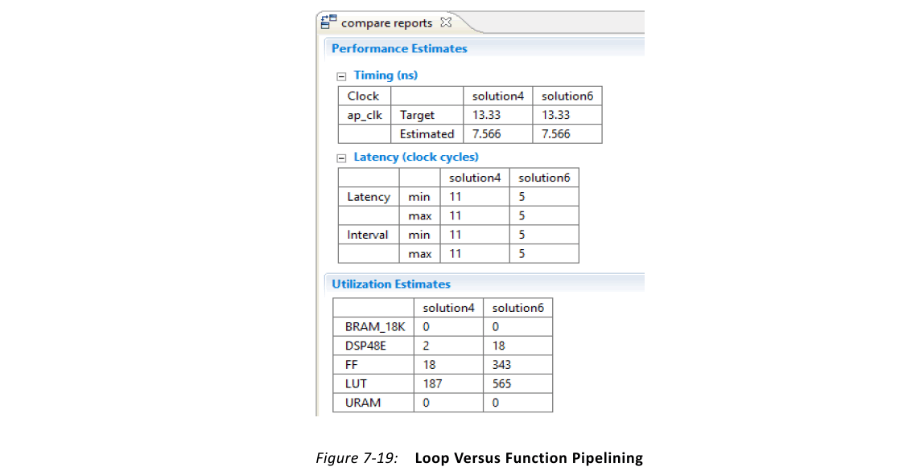

现在，设计可以用更少的时钟完成，并且可以每5个时钟周期开始一个新的事务。但是，由于展开了设计中的所有循环，因此面积和资源已大大增加。
```tcl
INFO: [XFORM 203-502] Unrolling all loops for pipelining in function 'matrixmul' (matrixmul.cpp:49).
INFO: [HLS 200-489] Unrolling loop 'Row' (matrixmul.cpp:54) in function 'matrixmul' completely with a factor of 3.
INFO: [HLS 200-489] Unrolling loop 'Col' (matrixmul.cpp:56) in function 'matrixmul' completely with a factor of 3.
INFO: [HLS 200-489] Unrolling loop 'Product' (matrixmul.cpp:59) in function 'matrixmul' completely with a factor of 3.
```
流水线循环使循环保持rolled状态，从而提供了控制面积的好方法。**对函数进行流水线处理时，将展开该函数中包含的所有循环，这是流水线处理的要求**。流水线功能设计可以**每5个时钟周期处理一组新的9个采样**。这超出了每个时钟1个样本的要求，因为“高级综合”的默认行为是生成具有最高性能的设计。

流水线功能可实现最佳性能。但是，**如果超出了所需的性能，则可能需要使用多个其他指令来减慢设计速度**。

流水线循环使您可以轻松控制资源，可以选择部分展开设计以满足性能。

#### 我的分析

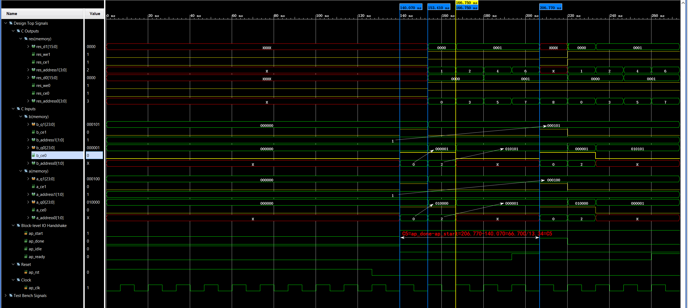

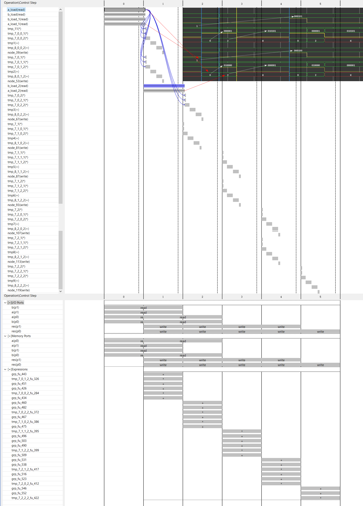

### 综合对比


## Lab 2: C Code Optimized for I/O Accesses

在实验1中，您无法使用流接口。C代码的性质（指定对同一地址的多次访问）阻止了流接口的应用。
- 在流接口中，必须按顺序访问值。
- 在代码中，访问也是端口访问，高级综合无法移动和优化。指定的C代码在每次product循环开始时将零值写入端口res。这可能是预期行为的一部分。HLS不能简单地决定更改算法的规范。

该代码直观地捕获了矩阵乘法的行为，但它阻止了硬件中的必需行为：流式访问。

本实验练习使用您在实验1中使用过的C代码的更新版本。以下说明了如何更新C代码。

图7-20显示了实验1中代码的I/O访问模式。地址值不一定用小字体显示。【a/b对应的4/5行为矩阵序号】

当变量i，j和k从0迭代到3时，图7-20的下部显示了生成的用于读取a，b和写入res的地址。此外，在每个Product循环的开始，将res设置为零值。


要进行具有顺序流访问的硬件设计，**端口访问只能是以红色突出显示的端口**。对于读端口，必须在内部缓存数据，以确保设计不必重新读取端口。对于写端口res，必须将数据**保存到一个临时变量中**，并且仅在红色显示的周期内将其写入端口。

本实验中的C代码反映了此行为。

```
D:\workspace\study\FPGA\HLS\Xilinx\UG871\ug871-design-files\Design_Optimization\lab2>vivado_hls -f run_hls.tcl

****** Vivado(TM) HLS - High-Level Synthesis from C, C++ and SystemC v2018.3 (64-bit)
  **** SW Build 2405991 on Thu Dec  6 23:38:27 MST 2018
  **** IP Build 2404404 on Fri Dec  7 01:43:56 MST 2018
    ** Copyright 1986-2018 Xilinx, Inc. All Rights Reserved.

source C:/Xilinx/Vivado/2018.3/scripts/vivado_hls/hls.tcl -notrace
INFO: [HLS 200-10] Running 'C:/Xilinx/Vivado/2018.3/bin/unwrapped/win64.o/vivado_hls.exe'
INFO: [HLS 200-10] For user 'skd22' on host 'desktop-cl29dn1' (Windows NT_amd64 version 6.2) on Mon Dec 02 16:15:03 +0800 2019
INFO: [HLS 200-10] In directory 'D:/workspace/study/FPGA/HLS/Xilinx/UG871/ug871-design-files/Design_Optimization/lab2'
INFO: [HLS 200-10] Creating and opening project 'D:/workspace/study/FPGA/HLS/Xilinx/UG871/ug871-design-files/Design_Optimization/lab2/matrixmul_prj'.
INFO: [HLS 200-10] Adding design file 'matrixmul.cpp' to the project
INFO: [HLS 200-10] Adding test bench file 'matrixmul_test.cpp' to the project
INFO: [HLS 200-10] Creating and opening solution 'D:/workspace/study/FPGA/HLS/Xilinx/UG871/ug871-design-files/Design_Optimization/lab2/matrixmul_prj/solution1'.
INFO: [HLS 200-10] Cleaning up the solution database.
INFO: [HLS 200-10] Setting target device to 'xczu9eg-ffvb1156-2-i'
INFO: [SYN 201-201] Setting up clock 'default' with a period of 13.333ns.
INFO: [SIM 211-2] *************** CSIM start ***************
INFO: [SIM 211-4] CSIM will launch GCC as the compiler.
   Compiling ../../../../matrixmul_test.cpp in debug mode
   Compiling ../../../../matrixmul.cpp in debug mode
   Generating csim.exe
Test passes.
INFO: [SIM 211-1] CSim done with 0 errors.
INFO: [SIM 211-3] *************** CSIM finish ***************
INFO: [Common 17-206] Exiting vivado_hls at Mon Dec  2 16:15:05 2019...
D:\workspace\study\FPGA\HLS\Xilinx\UG871\ug871-design-files\Design_Optimization\lab2>vivado_hls -p matrixmul_prj

****** Vivado(TM) HLS - High-Level Synthesis from C, C++ and SystemC v2018.3 (64-bit)
  **** SW Build 2405991 on Thu Dec  6 23:38:27 MST 2018
  **** IP Build 2404404 on Fri Dec  7 01:43:56 MST 2018
    ** Copyright 1986-2018 Xilinx, Inc. All Rights Reserved.

source C:/Xilinx/Vivado/2018.3/scripts/vivado_hls/hls.tcl -notrace
INFO: [HLS 200-10] Running 'C:/Xilinx/Vivado/2018.3/bin/unwrapped/win64.o/vivado_hls.exe'
INFO: [HLS 200-10] For user 'skd22' on host 'desktop-cl29dn1' (Windows NT_amd64 version 6.2) on Mon Dec 02 16:15:13 +0800 2019
INFO: [HLS 200-10] In directory 'D:/workspace/study/FPGA/HLS/Xilinx/UG871/ug871-design-files/Design_Optimization/lab2'
INFO: [HLS 200-10] Bringing up Vivado HLS GUI ...
```

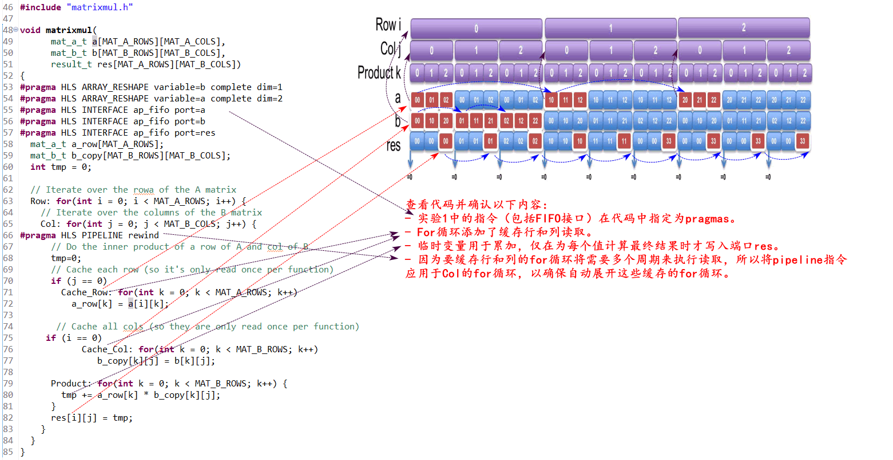


